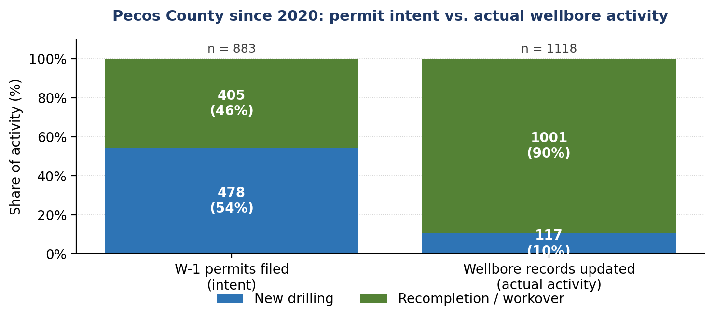
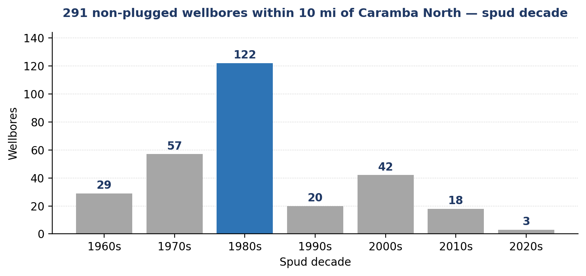
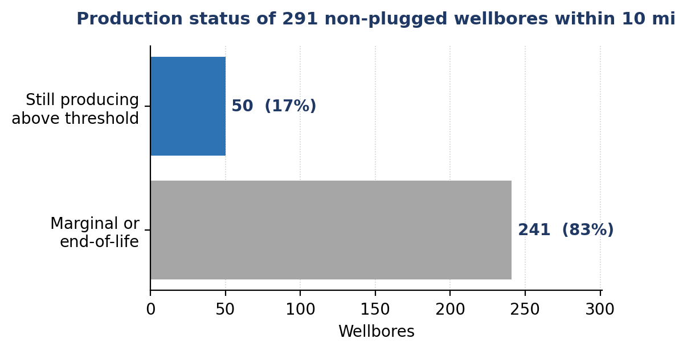
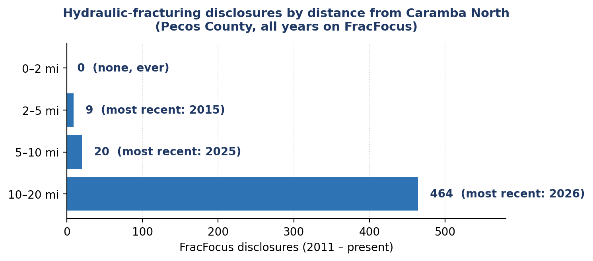

# Pecos County Drilling Activity — Historical & Recent Record

**CONFIDENTIAL — PECOS COUNTY · CARAMBA NORTH**

**Prepared:** 2026-05-19 · **Subject site:** Caramba North tract (≈1,300 ac), Pecos County, TX — centroid ≈ 30.9032° N, 102.9747° W · **Classification:** Confidential

## Purpose

This memorandum summarizes the historical and recent record of oil-and-gas drilling — with attention to shallow (<3,000 ft) wells — at and within ten miles of the Caramba North tract, drawn from the Railroad Commission of Texas (RRC) wellbore and drilling-permit records. It is provided as context for evaluating potential ground-vibration considerations for a data-center development on the site. Throughout, **new drilling (a new wellbore) is distinguished from recompletions (rework of an existing wellbore — no new hole drilled)**; only new drilling involves a drilling rig and the hydraulic-fracturing completion associated with ground vibration.

Proximity is reported at explicit distances from the tract centroid — principally **within two miles** and **within ten miles**. Ten miles is a deliberately generous boundary: ground vibration from drilling and completion attenuates well within that distance.

*This report is intended to accompany and utilizes the data underlying the interactive map of Caramba North, which can be accessed through [this link](https://lrp-tx-gis.netlify.app).*

## Table of Contents

1. [Purpose](#purpose)
2. [Summary of findings](#summary-of-findings)
3. [Findings](#findings)
   1. [On the Caramba North tract](#1-on-the-caramba-north-tract)
   2. [Drilling activity in Pecos is mostly recompletions of existing wells — not new drilling](#2-drilling-activity-in-pecos-is-mostly-recompletions-of-existing-wells--not-new-drilling)
   3. [Within 1 mile — no shallow wells](#3-within-1-mile--no-shallow-wells)
   4. [Within 2 miles — drilling ended over two decades ago](#4-within-2-miles--drilling-ended-over-two-decades-ago)
   5. [New drilling since 2020, by distance and depth](#5-new-drilling-since-2020-by-distance-and-depth)
   6. [The nearest non-plugged shallow wells are decades-old completions](#6-the-nearest-non-plugged-shallow-wells-are-decades-old-completions)
   7. [County-wide context — new drilling is deep, and remote from the site](#7-county-wide-context--new-drilling-is-deep-and-remote-from-the-site)
   8. [Pecos vs. peer counties — the least new drilling of the group](#8-pecos-vs-peer-counties--the-least-new-drilling-of-the-group)
   9. [Production near the site is decades-old completions — no active drilling or hydraulic-fracturing operations](#9-production-near-the-site-is-decades-old-completions--no-active-drilling-or-hydraulic-fracturing-operations)
   10. [The public fracking record (FracFocus) confirms: no fracking jobs within two miles of the tract, ever](#10-the-public-fracking-record-fracfocus-confirms-no-fracking-jobs-within-two-miles-of-the-tract-ever)

## Summary of findings

**No new drilling is occurring at or near the Caramba North site.** Counting only genuine new wells (wellbore records, recompletion re-stamps excluded): **no well of any kind has been spudded within two miles of the tract in over a decade**, **no new-drill well lies within five miles**, and only **three new-drill wells sit within ten miles** across all of 2020–2025 (nearest ≈ 6.9 miles; all three are deep ≥9,200 ft, spud 2020 and 2025).

The wells within two miles are all decades-old legacy completions (drilled 1950s–2002) — mostly plugged shallow verticals plus a handful of long-completed deep wells — **none representing active drilling, hydraulic fracturing, or a vibration source.**

Independently confirmed by the public hydraulic-fracturing disclosure record (FracFocus, 2011–present): **no frack job has ever been filed within two miles of the tract, and the most recent within five miles was 2015.** See Finding 10.

**Two further points reinforce this:**

- **Drilling activity in Pecos is mostly rework of existing wells, not new drilling.** Tracing every Pecos wellbore record updated since 2020 (RRC dbf900 — every event tagged to a unique API well number): **only ≈10% (117 of 1,118) are genuine new drilling — the other ≈90% (1,001) are recompletion or workover events on existing wellbores.** The recompletion activity is overwhelmingly **Kinder Morgan Production** reworking existing CO₂-flood (enhanced-recovery) fields — a workover rig on an existing bore, not the drilling-and-fracturing activity at issue, and not near the site.
- **Genuine new drilling is deep, not shallow — and remote.** Of the **116 genuine new wells drilled in Pecos since 2020**, ≈**95% are deep (≥3,000 ft)** and only six are shallow. New shallow drilling is therefore nearly nonexistent anywhere in Pecos, and the deep new drilling that does occur is concentrated well away from the tract (median 20 miles out — see Finding 5).

## Findings

### 1. On the Caramba North tract

The shallowest wellbores recorded inside the tract boundary:

| Depth (ft) | Spud year | Status | Oil/Gas |
|---|---|---|---|
| 2,873 | 1960 | Plugged &amp; abandoned | Gas |
| 3,067 | 1991 | Plugged &amp; abandoned | Oil |
| 3,109 | 1957 | Plugged &amp; abandoned | Oil |
| 3,186 | 1987 | Plugged &amp; abandoned | Oil |
| 3,250 | 2008 | Active | Oil |

Only one well on the tract lies below 3,000 ft — a 2,873-ft well spudded in 1960 and long since plugged and abandoned. The only active well on the tract (3,250 ft, spudded 2008) is deeper than 3,000 ft. There has been no shallow (<3,000 ft) drilling on the tract in the modern era. *(The remaining tract records are a single deep 22,545-ft wellbore and permitted-but-undrilled location entries.)*

### 2. Drilling activity in Pecos is mostly recompletions of existing wells — not new drilling

This is the crux of the data. The Railroad Commission of Texas maintains a master wellbore database (dbf900) in which every drilling, completion, and workover event is logged against a unique API well number. Tracing every Pecos wellbore that has had *any* recorded activity since 2020:

| Activity in Pecos since 2020 (wellbore records) | Count | Share |
|---|---|---|
| **Genuine new drilling (a new wellbore drilled)** | **117** | **≈ 10%** |
| Recompletion or workover on an existing wellbore | 1,001 | ≈ 90% |
| **Total wellbore-record activity** | **1,118** | **100%** |

In other words, **about nine out of every ten "drilling-related" actions on a Pecos wellbore since 2020 are workovers on a well that already exists — not a new hole drilled**. A recompletion or workover uses a small workover rig on an existing bore; it is not the rig-and-hydraulic-fracturing activity associated with ground vibration.

The bulk of this recompletion activity is one operator — **Kinder Morgan Production** — reworking existing CO₂-flood (enhanced-recovery) fields. None of that involves a drilling rig spudding a new hole, none of it involves a new hydraulic-fracturing program, and the program is not near the Caramba North tract.

Whether the question is framed as shallow drilling, hydraulic fracturing, or new drilling of any kind, the record points the same way: **it is not happening at or near this site.**

### 3. Within 1 mile — no shallow wells

Three wellbores of any depth lie within one mile of the tract; **none is shallow (<3,000 ft).**

### 4. Within 2 miles — drilling ended over two decades ago

Of about 46 wellbores within two miles, the ten shallow wells were spudded between 1960 and 2002. The most recent shallow spud within two miles was in 2002, and most of these wells are plugged and abandoned. **No well of any kind — new drill or otherwise — has been spudded within two miles in over a decade.**

### 5. New drilling since 2020, by distance and depth

Counting only genuine new wells drilled in Pecos since 2020 (wellbore records, recompletion re-stamps excluded):

| Radius | New-drill wells, spudded ≥ 2020 |
|---|---|
| ≤ 2 mi | **0** |
| ≤ 5 mi | **0** |
| ≤ 10 mi | **3** (0 shallow, 3 deep; nearest ≈ 6.9 mi) |
| > 10 mi | **113** (median 20.1 mi, mean 21.1 mi, max 60.4 mi) |
| **County-wide total** | **116** |

The three genuine new wells within ten miles, across all of 2020–2025, are 6.9–9.4 miles out and all deep (≈9,200–9,500 ft TD; spudded 2020 and 2025) — none shallow, none within five miles.

The 113 new wells beyond ten miles are at a median distance of **≈ 20 miles** from the tract (max 60 mi). Their depths:

| Depth band | Wells (of 113) | Share |
|---|---|---|
| < 3,000 ft (shallow) | 6 | 5% |
| 3,000 – 4,999 ft | 0 | 0% |
| 5,000 – 9,999 ft | 58 | 51% |
| ≥ 10,000 ft | 49 | 43% |

That is, **107 of 113 (≈95%) of the new wells outside ten miles are deep (≥3,000 ft) — the modern Permian unconventional program** — at a median depth of ≈9,900 ft. The six shallow new-drill wells in the county since 2020 are all remote from the tract.

Even on the *loosest* possible count — every record with a 2020-or-later spud date, including recompletion-restamped records — it is still **zero within two miles** and only ≈23 within ten miles across the whole period. New drilling does not reach the site under any reading of the data.

### 6. The nearest non-plugged shallow wells are decades-old completions

The nearest non-plugged shallow wells were spudded in 1970 (1.28 mi) and 1988 (1.97 mi) — decades-old completions, not active drilling. A ground-vibration source is an operating drill rig or a hydraulic-fracturing operation; a plugged or long-completed wellbore is not.

**No active drilling is occurring adjacent to the tract.**

### 7. County-wide context — new drilling is deep, and remote from the site

Of the **116 genuine new wells drilled in Pecos County since 2020** (Pecos is ≈4,700 sq mi), about **95% are deep (≥3,000 ft)** — the modern Permian unconventional program, operator-concentrated in Diamondback, XTO, Continental, and Gordy. Only **three** lie within ten miles of the Caramba North tract, and none within five; the activity is overwhelmingly remote from the site (median 20 miles out — see Finding 5).

### 8. Pecos vs. peer counties — the least new drilling of the group

On the same genuine-new-drill basis (recompletions excluded), Pecos has dramatically less new drilling than comparable Permian counties. Wells spudded since 2020:

| County | New-drill wells since 2020 | of which shallow (<3,000 ft) |
|---|---|---|
| **Pecos** (site county) | **116** | 6 |
| Reeves | 1,044 | 35 |
| Midland | 1,487 | 15 |
| Martin | 1,616 | 19 |
| Reagan | 629 | 9 |
| Howard | 990 | 1 |
| Loving | 1,121 | 25 |
| **Other-6 average** | **≈1,148** | ≈17 |

Pecos's ≈116 genuine new wells are roughly **one-tenth of the average comparable county's** (≈1,148); Martin, the most active, has ≈1,616, and even the next-lowest comparison county (Reagan) has ≈629. Genuine new shallow drilling is negligible in every county (≤35). On a new-drill basis **Pecos is by far the least-drilled of the seven** — and, per Findings 1–6, essentially none of even that activity is within ten miles of the Caramba North tract.

*Howard and Loving counties were pulled from the Railroad Commission's full dbf900 wellbore file and integrated on the same genuine-new-drill basis. They lie outside the six-county sale-area set and well away from the tract; they are included here only to broaden the comparison.*

### 9. Production near the site is decades-old completions — no active drilling or hydraulic-fracturing operations

Every well was additionally cross-referenced against the Railroad Commission's PDQ production records for the most recent six reported months (through May 2026), joined by **API number** through the RRC's authoritative API-to-lease crosswalk — a match covering **≈99.6% of all non-plugged wells**.

A well is treated as **"marginal or end-of-life" when its lease's trailing-average output is at or below 125 Mcf/day of gas AND at or below 25 bbl/day of oil** — a strict marginal-well threshold.

Of the 291 **non-plugged wellbores** within ten miles of the Caramba North tract (recompletion re-stamps already excluded — these are physical wellbores, not paperwork records), **241 (about 83%) are marginal or end-of-life**.

**Why so many are end-of-life:** most of these wellbores were drilled decades ago and are naturally depleted. The "genuine new drill" filter only removes recompletion re-stamps; it does *not* restrict by spud date. The 291 wellbores within ten miles span the 1960s through 2020s, with the bulk drilled in the 1980s:

| Spud decade | Wellbores within 10 mi (non-plugged) |
|---|---|
| 1960s | 29 |
| 1970s | 57 |
| **1980s** | **122** |
| 1990s | 20 |
| 2000s | 42 |
| 2010s | 18 |
| 2020s | 3 |

The 50 still producing above the marginal threshold are not active drilling activity either: they are decades-old completions, in four groups —

- about 15 **legacy deep-gas wells** (mostly 1965–1978 spud, ≈17,000–22,800 ft);
- a cluster of ~31 **low-rate vertical conventional oil wells** at ≈3,150–3,440 ft depth (spud 1986–2012, mostly 2007–2012; all on a unitized lease producing roughly 37.5 bbl/day per well — a stripper-grade pumping operation);
- 3 **truly shallow (&lt;3,000 ft) oil wells** at 2,824–2,945 ft (spud 2004–2011, also at stripper rates just above the threshold); and
- the single **2020 deep-horizontal new-drill** noted in Finding 5 (9,237 ft, 9.37 mi out).

Within five miles, **52 of 86 non-plugged wellbores are marginal or end-of-life** and the 34 still producing are 3 of the legacy deep-gas wells plus 31 of the shallow vertical oil cluster — none from the modern Permian horizontal program.

Within two miles, **3 of 5 non-plugged wellbores are marginal or end-of-life** and the 2 still producing are the 1.13-mi 1975/≈22,100-ft legacy gas well (125.7 Mcf/d) and a 1.97-mi 2008/≈3,275-ft vertical oil well (37.5 bbl/d).

A pumping wellhead or low-rate gas well on a decades-old completion is not a drill rig or a hydraulic-fracturing spread; together with the plugged legacy wells discussed above, **there is no active drilling or hydraulic-fracturing operation at or near the site.**

*County-wide, of the ≈35,100 non-plugged wellbores in the six sale-area counties, ≈12,540 are plugged, ≈12,490 are marginal or end-of-life by this measure, and ≈10,060 are still producing above the threshold. The API-to-lease crosswalk matches ≈99.6% of non-plugged wells; the ≈90 that do not match are conservatively left classified "Active." Production filings carry a normal reporting lag, which the six-month trailing window mitigates.*

### 10. The public fracking record (FracFocus) confirms: no fracking jobs within two miles of the tract, ever

The Texas **FracFocus disclosure database** ([fracfocus.org](https://fracfocus.org)) is the public record of every hydraulic-fracturing job that operators have filed in Texas since 2011. Cross-referencing every Pecos County disclosure (949 in total) against the Caramba North tract:

| Distance band from tract | Frack disclosures (2011 – present) | Most recent year |
|---|---|---|
| **0 – 2 mi** | **0** | — none, ever |
| 2 – 5 mi | 9 | 2015 (most recent) |
| 5 – 10 mi | 20 | 2025 |
| 10 – 20 mi | 464 | 2026 |

**No hydraulic-fracturing job has ever been performed within two miles of the Caramba North tract.** Within five miles there have been 9 fracks, all between 2012 and 2015 — the most recent over a decade ago. Eight of the nine were Apache Corporation's 2012 multi-well program (FSSU wells, 2.75–4.85 mi out); the ninth was Flamingo Operating in 2015. Within ten miles, 29 fracks over the entire 2012–2025 period, the closest to the site being the 2025 Mongoose Energy Viper wells at 6.94 mi out.

The broader Permian fracking program does exist — 493 fracks within twenty miles since 2011, dominated by the deep-horizontal unconventional players (Diamondback, XTO/ExxonMobil, Gordy). But that activity is concentrated well outside the 10-mile buffer, almost entirely at unconventional depths (median TVD ≈ 9,800 ft within 20 mi), and even there annual volume has been declining (39 fracks in Pecos in 2023, 6 in 2024, 21 in 2025, 11 year-to-date 2026 vs. a 2018–2019 peak of 113–167/year).

This is direct, evidence-based confirmation of what the wellbore-and-production record already implied: **no active hydraulic-fracturing operation is occurring at or near the Caramba North tract — neither on horizontal wellbores nor on vertical wellbores, and the closest disclosed frack within five miles is over a decade old.**
