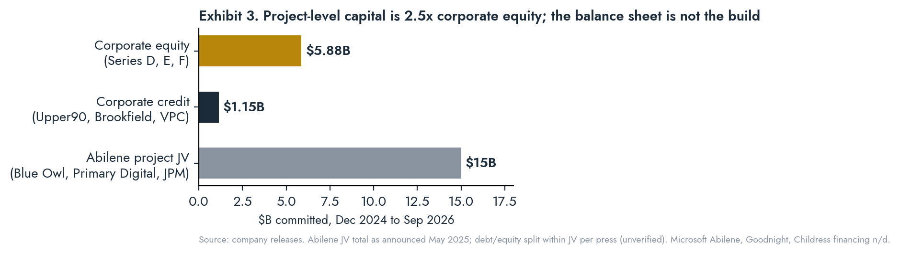
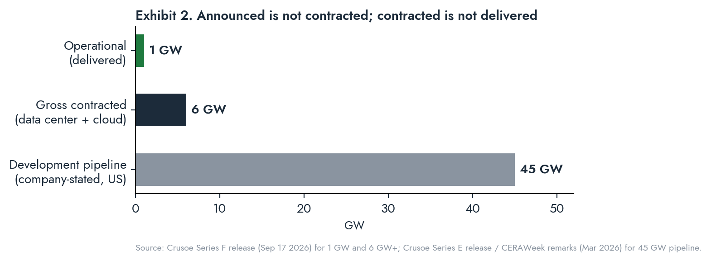

# THE GRID WIRE

## Special Report · Crusoe: Thesis, Capitalization, Execution · September 22, 2026

*A company-level analysis of Chase Lochmiller's Crusoe: the founding thesis, how it has been capitalized across equity, corporate credit and project finance, what is actually being built and where, how the modular Spark program and the owned-generation strategy fit together, and how the delivery record compares with the contracted book. Method: primary documents first (company releases, TCEQ registrations, county and TDLR filings, SEC exhibits), on-record actors second, trade press flagged as data points. Undisclosed figures are marked n/d and are not estimated. Revenue figures are third-party estimates and are labeled as such.*

TOPLINE_START
GREEN|Series F initial close September 17: $3.9B at $30.9B post-money, 3.1x the October 2025 mark in 11 months. Cumulative primary equity since December 2024: $5.9B. Cumulative disclosed corporate credit: $1.15B. Abilene project JV: $15B.
GREEN|Execution record is real where Crusoe owns the power. Abilene Phase 1 (206 MW, two buildings) energized within twelve months of groundbreaking. 360.5 MW of on-site aeroderivative gas operating under TCEQ Registration 177263. 1 GW gross capacity operational company-wide.
RED|The delivery gap is the risk. 6 GW+ gross contracted against 1 GW operational (~17%). $140B+ TCV has no disclosed tenor, concentration or cancellation terms. Financing the remaining ~5 GW is a project-finance problem, not a balance-sheet problem.
GREEN|Turbine procurement is the moat: 29 GE Vernova LM2500 (~1 GW), 13 PROENERGY PE6000 (650 MW, delivery by summer 2027), 10 units operating at Abilene, 41 more in a pending TCEQ major permit.
RED|Crusoe exited Project Jade (Wyoming, 1.8 GW to 10 GW) "at the request of our customer," demobilizing around April 2026. The only campus where a partner owned both land and generation is the only campus abandoned.
GREEN|Spark is manufactured, not constructed: 352,000 sq ft Brighton factory, $200M+, ~1 MW per unit, stated 100 units per year, first factory units Q3 2026; Redwood (24 units) and Energy Vault (up to 25 MW, sale-leaseback) as launch offtake.
TOPLINE_END

STATS: POST-MONEY | $30.9B | Series F, Sep 17 2026
STATS: EQUITY SINCE DEC 2024 | $5.9B | D + E + F
STATS: TCV | $140B+ | tenor, concentration n/d
STATS: CONTRACTED / LIVE | 6 / 1 GW | ~17% delivered
STATS: TURBINES BOOKED | 1.65 GW | GE Vernova + PROENERGY
STATS: SPARK TARGET | 100 / yr | ~1 MW per unit

CLOCKS: Spark first factory-built units | Q3 2026 | Brighton, CO
CLOCKS: Childress 1.4 GW construction start | Q3 2026 | Lancium site
CLOCKS: Goodnight buildings phased live | Aug 2026 to Feb 2027 | Armstrong Co.
CLOCKS: Abilene Oracle/OpenAI 700+ MW live | Dec 2026 | company target
CLOCKS: Snyder 8 MW Spark COD | Q1 2027 | Energy Vault
CLOCKS: PROENERGY 650 MW delivered | Summer 2027 | hyperscale campuses
CLOCKS: Microsoft Abilene first building | Mid 2027 | 900 MW campus
CLOCKS: Form Energy first deliveries | 2027 | 12 GWh reserved

---

# I. The Thesis in One Paragraph

KICKER: Crusoe's thesis is that the lowest-cost producer of intelligence is whoever controls the electrons. Everything the company has financed since 2024 is a bet on that sentence.

Crusoe's founding algorithm, written in 2018, was to move the computer to the energy rather than the energy to the computer. The algorithm has not changed. What changed is the payload (ASICs became GPUs), the unit size (a flare-site container became a 1.2 GW campus and, in parallel, a 1 MW factory-built module), and the counterparty (oil producers became Oracle, Microsoft, OpenAI and Jane Street). Lochmiller's stated frame is "controlling the infrastructure from electrons to tokens"; Atreides' Gavin Baker restated it at the Series F as "the economics flow to the lowest-cost producer of intelligence." Every material capital decision reads the same way: buy the turbines before the tenant is signed, permit the plant before the campus is announced, procure storage before the grid arrives, and manufacture the building so the field schedule is measured in weeks. This report tests that thesis against three things: how the company is capitalized, what has actually been delivered, and the one project it walked away from.

---

# II. Origins and the Carve-Out

KICKER: The first business was a power business with a compute exhaust. The company sold the application and kept the capability.

Chase Lochmiller (MIT mathematics and physics; Stanford MS computer science, AI specialization; quantitative trader at GETCO and Jump Trading; general partner at Polychain Capital) co-founded Crusoe Energy Systems in Denver in 2018 with Cully Cavness (now president and chief strategy officer). The product was Digital Flare Mitigation: a modular data center trucked to a wellhead, fed by associated gas the operator would otherwise flare, running Bitcoin ASICs. The economics were a power arbitrage: wellhead gas at zero or negative cost, monetized at network hash price.

Milestones: Upper90 equipment loan (2019); Series B led by Valor Equity Partners (2021); $505M Series C plus debt led by G2 Venture Partners (April 2022) with the CrusoeCloud launch; acquisition of Easter-Owens Electric (June 2022) for in-house switchgear and enclosure manufacturing; first GPU colocation at atNorth ICE02, Iceland (late 2023); Series D $600M at $2.8B led by Founders Fund (December 2024).

In March 2025 Crusoe sold the entire Bitcoin and DFM business to NYDIG (Stone Ridge Holdings Group): 425+ modular units, 270+ MW of generation across seven states and an Argentina JV, 135 employees. Crusoe took a retained equity position second only to Stone Ridge. Terms n/d. Cavness stated AI was already the majority of revenue.

<<<ANGLE
The carve-out is the analytically important event. A company that spent seven years learning to site, permit, fuel and operate small gas generation in remote counties sold the cash-flowing application and kept the capability, plus two assets that do not appear on a balance sheet: a permitting record with TCEQ, state air regulators and county commissions in gas-producing jurisdictions, and a manufacturing arm that builds electrical infrastructure in-house. Spark is that arm with a GPU rack inside. Abilene is the DFM site plan with a hyperscaler instead of an operator.
>>>

---

# III. Financing and Capitalization

KICKER: Three capital layers, three different risk owners. The equity funds the company; the project JVs fund the buildings; the credit facilities fund the GPUs.

## Equity

| Round | Date | Amount | Post-money | Lead / co-lead | Notable participants |
|---|---|---|---|---|---|
| Seed / A | 2019 | n/d | n/d | Founders Fund, Bain Capital Ventures (reported) | Upper90 (equipment loan) |
| Series B | 2021 | n/d | n/d | Valor Equity Partners | n/d |
| Series C (+ debt) | Apr 2022 | $505M total (equity/debt split n/d) | n/d | G2 Venture Partners | Oman Investment Authority (first invested Jun 2022 per Tracxn) |
| Series D | Dec 2024 | $600M | $2.8B | Founders Fund | NVIDIA, Mubadala, Ribbit, Long Journey (first Crusoe investments) |
| Series E | Oct 2025 | $1.375B (initial close) | $10B+ | Valor, Mubadala Capital | NVIDIA, Fidelity, T. Rowe, Tiger, Founders Fund, Atreides, Altimeter, Supermicro, DPR, Salesforce Ventures, Upper90; Blue Owl expected in later close |
| Series F | Sep 17 2026 | $3.9B (initial close, oversubscribed) | $30.9B | Atreides, Mubadala Capital, Valor | GIC, QIA, OIA, NVIDIA, Founders Fund, Radical, TPG, Fidelity, T. Rowe, Baillie Gifford, Tiger, ARK, Altimeter, StepStone, Salesforce Ventures, DPR, Polychain, SemiAnalysis, Squarepoint |

Cumulative primary equity since December 2024: $5.875B. Total capital raised across debt and equity is reported by third parties in the $5.4B to $5.8B range before Series F; the company has not published a cumulative figure. Ownership n/d. No secondary sales disclosed.

## Corporate credit

| Facility | Date | Amount | Lender / syndicate | Use | Terms |
|---|---|---|---|---|---|
| Equipment loan | 2019 | n/d | Upper90 | DFM units | n/d |
| First GPU debt facility | 2023 | n/d | Upper90 | GPUs | n/d |
| GPU credit facility | Mar 2025 | ~$225M | Upper90 (lead); BCI, FS Investments, King Street, Liberty Mutual, ORIX USA | NVIDIA GPUs and cloud infrastructure only | Asset-backed; rate, tenor n/d |
| Infrastructure debt | Jun 2025 | $750M | Brookfield Asset Management (infrastructure debt platform) | "energy-first AI factories" | n/d |
| Credit facility | Aug 2025 | $175M | Victory Park Capital | n/d | n/d |

Total disclosed corporate credit: ~$1.15B. All three 2025 facilities are asset-backed against GPUs or infrastructure; none is disclosed as recourse to the parent beyond the collateral.

## Project-level finance

| Project | Date | Structure | Amount | Parties | Security / tenor |
|---|---|---|---|---|---|
| Abilene Phase 1 (206 MW, 2 bldgs, 998,000 sq ft) | Oct 2024 | JV, fully funded forward takeout | $3.4B | Blue Owl Real Estate, Primary Digital Infrastructure; Crusoe as developer/operator | Oracle lease, reported 15 years; JPMorgan $2.3B loan reported (May 2025) |
| Abilene Phase 2 (6 bldgs, to 1.2 GW) | May 2025 | JV expansion | $11.6B (total JV $15B) | Blue Owl Real Assets, Primary Digital, Crusoe | Press: $9.6B JPMorgan debt, $5B equity; $7.1B Newmark-arranged construction loan led by JPMorgan. Rate, covenants n/d |
| Abilene Microsoft campus (900 MW, 2 bldgs + power plant) | Mar 2026 | n/d | n/d | Microsoft anchor | n/d |
| Goodnight / Project Llano (1 GW+, 7 bldgs) | 2025 to 2026 | n/d; county tax abatements | up to $29B stated capex | GN DC1, LLC | Phase 1 COD required by 2027 under abatement |
| Childress (1.4 GW) | Jul 2026 | Lancium provides land and energy infrastructure | n/d | Lancium, Crusoe | n/d |
| Snyder Spark (8 to 25 MW) | Feb to Jul 2026 | Sale-leaseback: Energy Vault buys 10 Spark units, leases back as powered shell | n/d | Energy Vault (NYSE: NRGV), Crusoe Cloud | 8-K exhibit 99.1 filed |
| Alberta (3 x 170 MW) | Feb 2025 framework | Crusoe develops/owns DCs; buys power under PPAs | CAD $1B unlevered capex per plant (KDP) | KALiNA Distributed Power | PPA minimum 15 years |
| Cheyenne / Project Jade (1.8 to 10 GW) | Jul 2025 to Apr 2026 | Tallgrass owns land and 2.7 GW gas hub; Crusoe developer | $50B stated total; $7B power | Tallgrass (Blackstone-backed) | Crusoe exited; Tallgrass continues |

<<<ANGLE
Read the three layers as a risk map. The equity sits at the parent and carries the development platform, Spark manufacturing, Crusoe Cloud and the turbine deposits. The corporate credit is collateralized against GPUs and repriced as GPUs depreciate; it is the layer most exposed to cloud utilization and rental-rate compression. The project JVs carry the buildings and are secured on hyperscaler leases; Crusoe is developer, operator and minority co-sponsor, not the balance sheet. This is the correct architecture for a company that wants to build 6 GW on $5.9B of equity, and it means two things. First, Crusoe's equity is a claim on development fees, operating margin and cloud gross margin, not on real estate. Second, the delivery of the remaining ~5 GW depends on repeating the Blue Owl structure four or five more times into a long end that reached a 2007 high in May 2026. The Series F does not fund the build. It funds the company's ability to originate the next JV.
>>>

## What the equity is buying

The company disclosed no revenue, EBITDA or cash-flow figure with either the Series E or Series F. Third-party estimates (Sacra, unverified): 2023 revenue ~$152M, mostly Bitcoin; 2024 ~$276M with AI cloud ~45% of mix; 2025 projected ~$500M; Abilene alone projected at ~$250M of 2026 revenue. Company-stated operating metrics: cloud bookings up 20x year over year YTD 2026; 17x growth in added TCV during 2025; 150% cloud ARR growth in 2025; Managed Inference contracted ARR over $100M within roughly nine months of launch. At $30.9B post and ~$500M of estimated 2025 revenue, the implied multiple is above 60x trailing revenue and is defensible only as a multiple of contracted forward capacity. That is how the round was marketed.

---

# IV. The Project Register

KICKER: Eleven named sites, four power models, one exit. Only Abilene is fully financed and partly operating.

| Site | County / jurisdiction | IT capacity | Power model | Customer | Status (Sep 2026) |
|---|---|---|---|---|---|
| Abilene I (Stargate I) | Taylor Co., TX (ERCOT) | 1.2 GW, 8 bldgs | 360.5 MW BTM gas + grid; 41-turbine expansion permit pending | Oracle (OpenAI behind Oracle), 15-yr lease reported | Phase 1 live Sep 2025; 700+ MW targeted live Dec 2026 |
| Abilene II (Microsoft) | Taylor Co., TX | 900 MW, 2 bldgs | On-site power plant, config n/d | Microsoft | Announced Mar 2026; first bldg mid-2027 |
| Abilene Phase 3 | Taylor Co., TX | 2 bldgs, ~738,000 sq ft each | n/d | n/d | Filed (Baxtel); details n/d |
| Goodnight / Llano | Armstrong Co., TX (SPP) | 1 GW+ (530 + 500 MW), 7 bldgs | Goodnight 1 wind 265.5 MW PPA + grid; 933 MW gas plant reported, unverified | n/d (press: Meta) | Bldgs live Aug 2026 to Feb 2027; $500M per bldg TDLR filings |
| Childress | Childress Co., TX (ERCOT) | 1.4 GW | Lancium: grid + BTM solar + storage; Form Energy iron-air | n/d | Construction start Q3 2026 |
| Snyder AI (Spark) | Scurry Co., TX | 8 MW Phase 1, up to 25 MW | Energy Vault powered shell | Crusoe Cloud | Broke ground Jul 27 2026; COD Q1 2027 |
| Sparks NV (Spark) | Redwood campus | 4 units, expanding to 24 | 12 MW solar + 63 MWh second-life EV batteries; grid backup | Crusoe Cloud | Live Jun 2025; 99.2% availability |
| Alberta x3 | Myers, Alsike, Crossfield Energy Parks | up to 100,000 GPUs per bldg (first phase 998,000 sq ft) | KDP 170 MW gas plants each, 15-yr PPA | n/d | Framework agreement; development stage |
| Iceland | atNorth ICE02 | ~57 MW (expanded by 24 MW) | Icelandic grid (hydro/geothermal) | Crusoe Cloud | Operating since late 2023 |
| Norway | n/d | n/d | Norwegian grid | Crusoe Cloud | Lease signed |
| Franklin Co., VA ("Project Flash") | Virginia | n/d | n/d | n/d | Linked in filings; unconfirmed |
| Cheyenne / Jade | Laramie Co., WY | 1.8 GW to 10 GW | Tallgrass 2.7 GW gas hub | n/d | Crusoe exited ~Apr 2026 |

## Generation procurement

| Vendor | Units | Type | Nameplate | Delivery | Assignment |
|---|---|---|---|---|---|
| Solar Turbines | 5 | Titan 350 simple-cycle | ~190 MW | Operating | Abilene I |
| GE Vernova | 5 (of 29) | LM2500 aeroderivative | ~170 MW | Operating | Abilene I |
| GE Vernova | 24 (of 29) | LM2500 aeroderivative | ~820 MW | Ordered Dec 2024, Jun 2025 | Abilene expansion (41-turbine permit) and other campuses |
| PROENERGY | 13 | PE6000 aeroderivative, 50 MW each | 650 MW | By summer 2027 | "Upcoming hyperscale projects" |
| Form Energy | n/a | Iron-air, 100-hour storage | 12 GWh | From 2027 | Firming for BTM renewables (Childress) |
| Redwood Energy | n/a | Second-life EV battery storage | 63 MWh + 8 MW expansion | Operating / 2026 | Spark, Sparks NV |
| KDP (Alberta) | 3 plants | Gas, combined cycle with CCS planned | 510 MW | n/d | Alberta DCs via PPA |
| Tallgrass (exited) | n/a | Gas + Bloom fuel cells | 2.7 GW | 2027 | Jade (no longer Crusoe) |

Total Crusoe-owned or Crusoe-contracted turbine nameplate: ~2.0 GW (Solar + GE Vernova + PROENERGY) against 6 GW+ contracted IT load. Owned generation covers roughly one-third of the contracted book; the balance is grid interconnection (Abilene ERCOT, Goodnight SPP, Childress ERCOT) and partner-owned PPAs (Alberta).

---

# V. Power: The Layer Crusoe Actually Owns

KICKER: The aeroderivative choice trades heat rate for schedule. On a three-year heavy-frame queue that trade is the whole business.

TCEQ Standard Permit Registration 177263, approved January 22, 2025 for "Longhorn Data Center" (Abilene DC 1, LLC dba Crusoe Energy Systems), authorizes ten simple-cycle turbines totaling 360.5 MW for on-site use only, no grid export. The permit was filed five months before the Stargate announcement and approved in six days. A major TCEQ air permit filed July 2026 seeks 41 additional turbines (~1.4 GW) plus 18 diesel gensets and is in public comment. Reported gas-plant cost near $500M (trade press, unverified).

Crusoe did not buy the combined-cycle heavy frames that form ERCOT's backbone. It bought jet-engine derivatives: lower thermal efficiency, higher fuel cost per MWh, available on months rather than years. GE Vernova quotes heavy-frame lead times "directionally three years" with 2029 to 2030 slots selling now at 10 to 20 points above the prior cycle. Crusoe's 29 LM2500s and 13 PE6000s were booked in 2024 and 2025. That is a hard physical option whose strike price rose behind it.

<<<ANGLE
Two consequences follow. First, the fuel bill is the variable Crusoe has not disclosed. Simple-cycle aeroderivatives at 9,000 to 10,000 Btu/kWh on pipeline gas are cheap at Waha-adjacent West Texas prices and expensive at Henry Hub parity. Abilene sits on the West Texas side of that spread. Alberta sits on AECO, structurally discounted. Neither Goodnight nor Childress has disclosed a gas supply contract. Second, the regulatory frame moved against pure islanding: PUCT Project 58481 (SB6) applies large-load requirements to loads at or above 75 MW regardless of behind-the-meter status. Crusoe's answer is the ratepayer-protection pledge and bidirectional export. That is a policy posture, not a structural advantage.
>>>

---

# VI. Spark: Manufacturing the Data Center

KICKER: Spark is Digital Flare Mitigation with a GPU rack. Same algorithm, new payload, and now a factory.

**Product.** Prefabricated, containerized AI data center integrating power distribution, cooling, fire suppression, remote monitoring and GPU-ready racks. Public specifications: roughly 1 MW per unit, "a little larger than a shipping container" (Forbes); air-cooled today, liquid-cooled variant scheduled H2 2026. Pairs with solar plus second-life batteries, grid, gas generation or, in company materials, future SMRs. Company-stated timeline: three months from order to energization; field construction "from years to weeks."

**Factory.** Brighton, Colorado, 352,000 sq ft, announced March 12, 2026. Lease, build-out and initial fleet "more than $200 million." Target 100 units per year. First factory-built modules Q3 2026. Adds 200 jobs to a 500+ manufacturing base across Colorado, Oklahoma and Louisiana (the Easter-Owens footprint).

**Offtake structures.** Three so far: owned units on a partner's microgrid (Redwood, Sparks NV); sale-leaseback where a public storage company buys the units and leases them back as powered shell (Energy Vault, Snyder); and Edge Zones, where a customer with sovereignty or latency requirements takes capacity in a chosen geography. The Energy Vault template is the important one: Crusoe books hardware revenue, retains cloud margin, and moves the real-asset ownership to a counterparty that needs load for its storage. That is Spark scaling without Crusoe's equity carrying every module.

**What Spark feeds.** Crusoe Cloud IaaS, serverless fine-tuning, and Managed Inference (launched late 2025; contracted ARR over $100M; company claims 9.9x faster time-to-first-token and 5x throughput vs vLLM; ranked first for inference speed on Artificial Analysis). Named cloud customers: Jane Street, Perplexity (GB300 systems, multi-year), Cognition, Figure, Meta, Oracle.

| Dimension | Gigawatt campus (Abilene, Goodnight) | Spark module |
|---|---|---|
| Unit of capacity | 100 to 300 MW per building | ~1 MW per unit |
| Field schedule | 18 to 36 months | Weeks (company-stated) |
| Power source | BTM gas + grid interconnection | Any: solar+storage, gas, grid |
| Permitting exposure | Major air permit, county abatement, SB6 large-load | Minor source; below 75 MW per site |
| Labor exposure | 3,000 to 5,000 trades on site | Factory labor, small field crew |
| Customer | Hyperscaler, frontier lab, 10 to 15 yr lease | Crusoe Cloud, inference, sovereign edge |
| Balance-sheet model | Project JV, $15B scale | Sale-leaseback or owned |
| Revenue capture | Development fee + lease + operations | Hardware sale + cloud margin |

<<<ANGLE
Two readings, both correct. Spark is a power-siting instrument: a 1 MW unit monetizes stranded MW at the granularity at which stranded power actually exists, behind a battery recycler's fence or on a storage vendor's demonstration campus. And Spark does not move the contracted book: 100 units a year is 100 MW a year, under 2% of 6 GW. Spark is the origination and inference-margin engine; the campuses are the revenue engine. Investors who price Spark as the growth story are pricing the wrong line; investors who ignore it miss that the modules convert energy-development skill into cloud gross margin without waiting on a hyperscaler signature.
>>>

---

# VII. Case Studies in Execution

KICKER: Five episodes, three outcomes. Delivery where Crusoe owns the power; exit where it does not; carve-out where the application no longer fit.

## Case 1: Abilene Phase 1, twelve months from dirt to energization

Ground broke June 2024 on Lancium's Clean Campus. Two buildings, 206 MW, 998,000 sq ft, liquid-cooled, up to 100,000 GPUs on one fabric. The $3.4B forward takeout was signed October 2024 with the tenant unnamed in the release (Oracle, confirmed later). Phase 1 was running Oracle Cloud Infrastructure by January 2025 per company; GB200 racks began arriving June 2025; first phase went live September 2025. On-site generation permitted January 2025 and operating. Roughly 3,000 daily workers in Phase 1, rising toward 5,000 in Phase 2.

Outcome: delivered inside the announced window. Caveats: independent reporting (distilled.earth, June 2026) argues Stargate sites are taking longer and costing more than competitor builds, and the company's Series F claim that OpenAI trained "Astra, its first artificial general intelligence" at Abilene is a marketing statement not independently verifiable. Company target: 700+ MW live by December 2026.

## Case 2: Sparks, Nevada, the microgrid that validated Spark

Redwood Energy built a 12 MW solar plus 63 MWh second-life EV battery microgrid on its Sparks campus in under four months. Four Spark units (2,000 GPUs) went live June 2025 as the largest second-life battery deployment in the world. Seven months in: 99.2% microgrid availability; 99.9% for Crusoe Cloud with grid backup. March 2026: expansion to 24 units, roughly 7x compute on the same energy footprint, plus 8 MW of additional Redwood storage. JB Straubel joined Crusoe's board in September 2026.

Outcome: the product works off-grid on non-firm generation with battery firming. The vendor became a director.

## Case 3: Snyder, Texas, Spark as a sale-leaseback

Energy Vault (NYSE: NRGV) and Crusoe signed a framework in February 2026 (8-K exhibit 99.1) for up to 25 MW of Spark at Energy Vault's Snyder technology center. Energy Vault purchases 10 units and leases them back to Crusoe as powered shell; Crusoe Cloud sells training, fine-tuning and inference from them. Ground broke July 27, 2026; 8 MW Phase 1 COD targeted Q1 2027.

Outcome: pending. This is the first test of Spark on a third party's balance sheet and the first public-company disclosure of Spark unit economics if Energy Vault reports segment detail.

## Case 4: Cheyenne, the exit

Laramie County approved Project Jade and Tallgrass's 2.7 GW BFC Power and Cheyenne Power Hub unanimously on January 5, 2026: five 805,400 sq ft buildings on 600 acres, $7B of power, $50B total, first building by end-2027. Crusoe demobilized roughly two months before the June 9 disclosure. Company statement: "At the request of our customer, Crusoe has paused its development activities." Tallgrass continues, says the tenant is unchanged, and is in talks with replacement developers.

Outcome: the only campus where Crusoe controlled neither land nor generation is the only campus Crusoe left. Whether the customer pulled Crusoe or Crusoe declined to carry contractor-only risk, both parties reached the same conclusion: the power owner is the principal.

## Case 5: NYDIG, the carve-out

March 2025. 425+ units, 270+ MW, 135 employees, seven states, Argentina JV, sold to NYDIG for an undisclosed price and a retained equity stake second only to Stone Ridge. Stone Ridge Energy controls over 10 GW of US gas production; NYDIG kept the DFM technology and the team. Crusoe and NYDIG stated an ongoing partnership pairing Crusoe's development capability with NYDIG's securitization and financing.

Outcome: clean exit from a cash-flowing but non-core application; the buyer is now a potential financing partner for the core business.

---

# VIII. Contract Quality and Customer Concentration

KICKER: $140B of TCV, five disclosed anchor relationships, one quant firm at ~9%, and no tenor disclosed.

| Counterparty | Instrument | Disclosed value | Site / product | Source |
|---|---|---|---|---|
| Oracle (OpenAI behind Oracle) | Data center lease, reported 15 yr | n/d | Abilene I, 1.2 GW | Company; press for tenor |
| Microsoft | Data center campus | n/d | Abilene II, 900 MW | Company |
| Meta | Cloud / capacity agreement | n/d | Goodnight per press; cloud | Press |
| Jane Street | 5-yr cloud contract | ~$13B | GPU clusters on Crusoe Cloud | Bloomberg |
| Perplexity | Multi-year, full model lifecycle | n/d | GB300 training + Managed Inference | Company |
| Cognition, Figure | Cloud customers | n/d | Crusoe Cloud | Company |
| Energy Vault | Spark purchase + shell lease | n/d | Snyder | 8-K |

TCV aggregates three instruments with different credit profiles: 10 to 15 year real-estate leases to hyperscalers, 3 to 5 year cloud contracts to AI natives and financial firms, and development agreements. It is not backlog in the accounting sense, not recognized revenue, and not net of cancellation or step-down rights. Jane Street alone is ~9% of TCV from a single non-hyperscaler that in April 2026 also committed ~$6B to CoreWeave plus a $1B equity stake there. One quant firm is anchor tenant to two neoclouds simultaneously.

<<<GOLD
Compare the Abilene JV to CoreWeave's DDTL 4.0 (March 2026, $8.5B, SOFR + 225, MUFG/Morgan Stanley, Blackstone anchor). Both move the credit from the hardware to the offtaker; both defer coverage tests past the deployment ramp; both default on adverse events in the anchor contract. The difference is what sits underneath. CoreWeave's recovery floor is depreciating silicon in leased shells. Crusoe's is 360.5 MW of permitted, operating generation on a controlled site, 1.65 GW of booked turbines, and a manufacturing plant. If the offtaker thesis is tested, Crusoe owns the asset that reprices least. If it is not tested, Crusoe has paid for a heat-rate penalty and a factory it did not need. That is the trade the Series F investors made.
>>>

---

# IX. Management and Governance

KICKER: A quant CEO, a strategy-side co-founder, and a board that now contains a data center REIT CEO, a battery recycler and a hyperscale-network CFO.

Lochmiller is chairman and CEO; Cavness is president and chief strategy officer and the public face of the energy and Spark programs. Disclosed senior hires: Erwan Menard (ex-Google Cloud SVP) leading Crusoe Cloud platform; Matt Field as chief real estate officer. Headcount: 1,000+ in October 2025; 1,800+ across five countries in September 2026, with new offices in Bellevue, WA and New York City. September 2026 board additions: Thomas Seifert (Cloudflare CFO), Bill Stein (former Digital Realty CEO; Primary Digital Infrastructure), JB Straubel (Redwood Materials founder and CEO; Tesla director). Investors on record with board or observer roles n/d.

The board composition, the crossover book (Fidelity, T. Rowe, Baillie Gifford, Tiger, ARK, Altimeter) and the addition of a public-company CFO are the standard pre-IPO configuration. No S-1 has been filed or announced.

---

# X. Falsification Conditions

<<<FALSIFY
**The vertical-integration premium is falsified if** Crusoe's next campus is delivered on grid interconnection alone with no owned or contracted generation. That would show power ownership was a Stargate-specific artifact.

**The Spark thesis is falsified if** Brighton misses Q3 2026 first units by more than two quarters, or Snyder Phase 1 misses Q1 2027 COD. A modular product that cannot hold a modular schedule has no thesis.

**The contract-quality read is falsified if** Crusoe discloses TCV tenor and concentration and the top three counterparties are under 40% of TCV with weighted tenor over eight years.

**The capital-structure read is falsified if** the next gigawatt campus is financed on Crusoe's balance sheet rather than through a Blue Owl-type JV. That would mean the equity is buying real estate after all, and the multiple should compress toward a REIT.

**The Wyoming read is falsified if** the Jade tenant is revealed to have moved with Crusoe to a Crusoe-controlled site.

**The turbine-slot premium is falsified if** GE Vernova heavy-frame lead times compress below 18 months before 2028.

**The execution record is falsified if** Abilene misses 700+ MW live by December 2026 by more than one quarter, or the 41-turbine TCEQ permit is denied or materially conditioned.
>>>

---

# XI. Conclusions

1. **Crusoe is a power developer that sells compute, and the market's neocloud label misprices it in both directions.** It deserves a premium to GPU landlords on recovery value and a discount on capital intensity. The Series F resolved this in one direction only.

2. **The capital structure is correctly built for the thesis and is the thesis's main exposure.** $5.9B of equity, $1.15B of GPU-backed credit, $15B of project JV at one site. The remaining ~5 GW requires four or five more Blue Owl structures into a higher curve. The Series F funds origination, not construction.

3. **The aeroderivative fleet is the moat.** 42 units, ~2 GW, booked in 2024 and 2025 on a schedule the heavy-frame queue cannot match. It is the single most under-analyzed line in the company and the reason the recovery floor is real.

4. **Spark is the origination and margin engine, not the volume engine.** 100 MW a year against 6 GW contracted. Its value is converting energy-siting skill into inference margin and Edge Zone revenue without a hyperscaler signature, and the Energy Vault sale-leaseback shows how it scales off-balance-sheet.

5. **Execution is proven at one site and pending at four.** Abilene Phase 1 delivered inside twelve months. Goodnight, Childress, Abilene II and Alberta are all pre-COD. Wyoming was abandoned. The record supports the thesis where Crusoe owns the power and is silent everywhere else.

6. **The delivery gap is the risk, and the company has told you so in its own numbers.** Six GW contracted, one operating. Every metric disclosed with the Series F is a forward commitment; none is recognized revenue. The valuation is a multiple of contracts, and the contracts are a claim on a build that has not yet been financed.

---

*The Grid Wire is a capital markets and infrastructure briefing by Andrea Himmel, LAND · The Grid Wire. Sources: Crusoe company releases (Series C, D, E, F; Upper90, Brookfield facilities; Blue Owl JV Oct 2024 and May 2025; Spark Factory; Microsoft Abilene; Redwood; Form Energy; NYDIG; KALiNA); Energy Vault Form 8-K exhibit 99.1 (Feb 11, 2026); TCEQ Standard Permit Registration 177263 and July 2026 major permit docket; Laramie County Board of Commissioners approvals (Jan 5, 2026); Texas Department of Licensing and Regulation filings (GN DC1, LLC); Alberta Major Projects registry; Wyoming Tribune Eagle (Jun 9, 2026); Bloomberg (Series F, Jane Street); TechCrunch; Forbes; DatacenterDynamics; Power Magazine; GE Vernova disclosures. Revenue figures are Sacra estimates and unverified. Debt/equity split within the Abilene JV, gas-plant cost and Goodnight generation are trade-press figures and unverified. Nothing herein is investment advice or an offer to transact in any security.*
