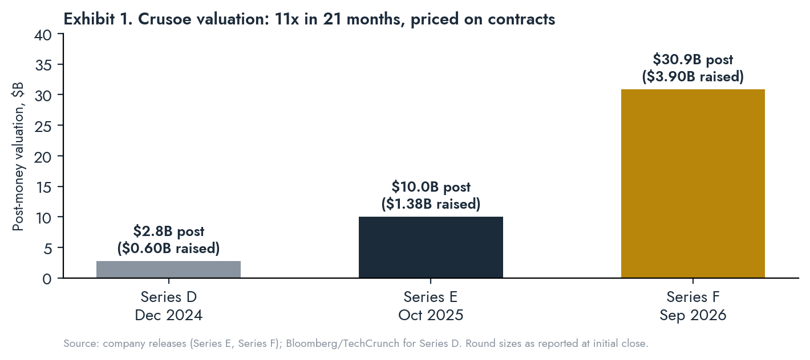

# THE GRID WIRE

## Special Report · Crusoe: From Flare Gas to the Factory · September 22, 2026

*A structural analysis of Chase Lochmiller's Crusoe, its pivot from stranded-gas Bitcoin mining to gigawatt campuses and factory-built modular data centers, and what the company's site selection reveals about where the binding constraint on AI infrastructure sits. Method: primary documents first (company releases, TCEQ registrations, county filings, SEC exhibits), on-record actors second, trade press flagged as data points. Undisclosed figures are marked n/d and are not estimated.*

TOPLINE_START
GREEN|Series F initial close September 17: $3.9B at $30.9B post-money, 3.1x the October 2025 mark in 11 months. The round prices contracts, not assets: 6 GW+ gross contracted against 1 GW delivered.
GREEN|Power is the product. Abilene runs 360.5 MW of behind-the-meter aeroderivative gas under TCEQ Registration 177263; a July 2026 major permit seeks 41 more turbines (~1.4 GW). GE Vernova has booked 29 LM2500 units for Crusoe.
GREEN|Spark converts the data center into a manufactured product: 352,000 sq ft Brighton factory, $200M+ committed, ~1 MW per unit, stated target 100 units per year, first factory units Q3 2026.
RED|Crusoe exited Project Jade (Wyoming, 1.8 GW scaling to 10 GW) "at the request of our customer" and demobilized around April 2026. Tallgrass proceeds with the 2.7 GW gas hub alone. Origination is not delivery.
RED|Contract concentration is the credit. Jane Street's $13B five-year cloud deal is ~9% of stated TCV; Oracle/OpenAI and Microsoft anchor 2.1 GW at Abilene. The instrument is the offtaker, the same architecture as CoreWeave DDTL 4.0.
GREEN|Storage is being procured as firming for owned generation: Form Energy 12 GWh iron-air from 2027; Redwood second-life 12 MW / 63 MWh microgrid at 99.2% availability, expanding 4 to 24 Spark units.
TOPLINE_END

STATS: POST-MONEY | $30.9B | Series F, Sep 17 2026
STATS: TCV | $140B+ | tenor, concentration n/d
STATS: CONTRACTED / LIVE | 6 / 1 GW | ~17% delivered
STATS: ABILENE GAS | 360 MW | +1.4 GW permit pending
STATS: SPARK TARGET | 100 / yr | ~1 MW per unit
STATS: JANE STREET | $13B | 5-year cloud contract

CLOCKS: Spark first factory-built units | Q3 2026 | Brighton, CO
CLOCKS: Childress 1.4 GW construction start | Q3 2026 | Lancium site
CLOCKS: Goodnight buildings phased live | Aug 2026 to Feb 2027 | Armstrong Co.
CLOCKS: Snyder 8 MW Spark COD | Q1 2027 | Energy Vault
CLOCKS: Form Energy first deliveries | 2027 | 12 GWh reserved
CLOCKS: Abilene 41-turbine major permit | public comment | TCEQ

---

# I. The Thesis in One Paragraph

KICKER: Crusoe is not a neocloud. It is a private utility that attaches compute to generation it controls, and the market is now paying for that distinction.

The market files Crusoe alongside CoreWeave, Nebius and Lambda because it sells GPU hours. The classification is wrong and the mispricing follows from it. Crusoe's founding algorithm, written in 2018, was to move the computer to the energy rather than the energy to the computer. That algorithm has not changed. What changed is the payload (ASICs became GPUs), the unit size (a flare-site container became a 1.2 GW campus and, in parallel, a 1 MW factory-built module), and the counterparty (oil producers became Oracle, Microsoft, OpenAI and Jane Street). Every material move of the last eighteen months reads the same way: buy the turbines before the tenant is signed, permit the plant before the campus is announced, procure storage before the grid arrives, and manufacture the building so the field schedule is measured in weeks. The Series F prices this as a solved model. This report tests that pricing against the delivery record, the contract quality, and the one project the company walked away from.

---

# II. Origins: Flare-Gas Arbitrage as Operating System (2018 to 2025)

KICKER: The first business was a power business with a compute exhaust. The second business is the same thing at scale.

Chase Lochmiller (MIT mathematics and physics, Stanford MS computer science with an AI specialization, quantitative trader at GETCO and Jump Trading, general partner at Polychain Capital) co-founded Crusoe Energy Systems in Denver in 2018 with Cully Cavness. The product was Digital Flare Mitigation: a modular data center trucked to a wellhead, fed by associated gas that the operator would otherwise flare, running Bitcoin ASICs. The economics were a power arbitrage. Flare gas has a negative or zero cost at the wellhead; the miner monetizes it at the network hash price; the operator gets a flaring-reduction credit and a small offtake fee.

By March 2025 the fleet stood at more than 425 modular units, more than 250 MW of generation, across seven states and an Argentina joint venture. That month Crusoe sold the entire Bitcoin and DFM business to NYDIG (Stone Ridge Holdings Group), took a retained equity position second only to Stone Ridge, and transferred 135 employees. Terms n/d. Cavness stated at the time that AI had already become the majority of revenue.

<<<ANGLE
The sale is the analytically important event, not the Stargate contract. A company that had spent seven years learning to site, permit, fuel and operate small gas generation in remote counties sold the cash-flowing application and kept the capability. Everything since is that capability applied to a customer who pays more per MW than the Bitcoin network does. The flare-gas era also left two durable assets that do not appear on a balance sheet: a permitting record with TCEQ, state air regulators and county commissions in gas-producing jurisdictions, and a manufacturing arm (Easter-Owens Electric, acquired 2022) that builds switchgear and enclosures in-house. Spark is that arm with a GPU rack inside.
>>>

---

# III. The Pivot, Measured

KICKER: Eighteen months, roughly $20B of committed project capital, three sovereign funds, and one exit.

| Date | Event | Capital / capacity | Source class |
|---|---|---|---|
| Dec 2024 | Series D | $600M at $2.8B post | Company / press |
| Dec 2024 | GE Vernova turbine order, Abilene | 10 aeroderivative units | Trade press, GE Vernova |
| Jan 2025 | TCEQ Standard Permit 177263 approved | 360.5 MW BTM, 10 turbines | TCEQ (primary) |
| Mar 2025 | Bitcoin/DFM business sold to NYDIG | 425+ units, 250+ MW; terms n/d | Company / NYDIG |
| May 2025 | Abilene JV Phase 2 with Blue Owl, Primary Digital | $15B total; 1.2 GW, 8 buildings | Company |
| Jun 2025 | Crusoe Spark launched; Redwood microgrid live | 12 MW / 63 MWh, 4 units, Sparks NV | Company |
| Jun 2025 | Second GE Vernova order | 19 LM2500 units (~1 GW cumulative 29) | GE Vernova / press |
| Jul 2025 | Tallgrass partnership, Project Jade, Cheyenne | 1.8 GW scaling to 10 GW | Company / Tallgrass |
| Oct 2025 | Series E | $1.375B at $10B+ post; 45 GW pipeline stated | Company |
| Jan 2026 | Laramie County approves Jade + 2.7 GW gas hub | $50B est. total; $7B power | County (primary) |
| Feb 2026 | Energy Vault framework, Snyder TX | up to 25 MW Spark | SEC 8-K exhibit (primary) |
| Mar 2026 | Spark Factory, Brighton CO; Edge Zones launched | 352,000 sq ft; $200M+ | Company |
| Mar 2026 | Microsoft 900 MW Abilene campus announced | Abilene total 2.1 GW | Company |
| Mar 2026 | Form Energy 12 GWh; Redwood expansion 4 to 24 units | deliveries from 2027 | Company |
| ~Apr 2026 | Crusoe demobilizes from Project Jade | disclosed Jun 9 2026 | Bloomberg / WTE |
| Jul 2026 | Lancium partnership, Childress campus | 1.4 GW, 270 acres | Company / press |
| Jul 2026 | TCEQ major permit filed, Abilene expansion | +41 turbines (~1.4 GW), 18 gensets | TCEQ docket |
| Sep 3 2026 | Jane Street five-year cloud contract | ~$13B | Bloomberg |
| Sep 15 2026 | Perplexity multi-year partnership | GB300 systems; value n/d | Company |
| Sep 17 2026 | Series F initial close | $3.9B at $30.9B post | Company |

Three observations from the sequence. First, the turbines were ordered before the tenant was public in both Abilene tranches; the December 2024 order predates the Stargate announcement by a month and the TCEQ filing predates it by five. Second, the 45 GW pipeline figure has not been updated since October 2025 while contracted capacity moved from n/d to "over 6 GW." Third, the single project where Crusoe did not control the generation, Wyoming, is the single project Crusoe left.

---

# IV. Power: The Layer Crusoe Actually Owns

KICKER: Four campuses, four power models. Only one of them is an ERCOT-style large-load interconnection story.

## Abilene, Taylor County (Oracle/OpenAI 1.2 GW; Microsoft 900 MW)

TCEQ Standard Permit Registration 177263, approved January 22, 2025 for "Longhorn Data Center" (Abilene DC 1, LLC dba Crusoe Energy Systems), authorizes ten simple-cycle turbines: five Solar Titan 350 (~38 MW) and five GE LM2500 (~34.1 MW), 360.5 MW total, for on-site data center use only, no grid export. Those units are reported operational. A major TCEQ air permit filed July 2026 and in public comment seeks 41 additional turbines (~1.4 GW) plus 18 diesel gensets. GE Vernova separately confirmed booking 29 LM2500 units for Crusoe. Gas-plant cost is reported near $500M (trade press, unverified). The campus also carries an ERCOT interconnection; the ~1.2 GW figure describes IT load, not generation nameplate.

Financing per company and press: $15B total JV with Blue Owl Real Assets and Primary Digital Infrastructure; $9.6B JPMorgan debt and $5B equity reported; $7.1B Newmark-arranged construction loan reported for Phase 2. Terms, rate, tenor and covenants n/d. Crusoe's direct customer is Oracle; OpenAI is Oracle's customer.

The Microsoft campus announced March 27, 2026 adds two buildings and "an onsite power plant to support grid resilience," bringing the site to 2.1 GW projected. Power configuration n/d.

<<<ANGLE
The aeroderivative choice is the tell. Crusoe did not buy the combined-cycle frames that form the backbone of ERCOT's fleet. It bought jet-engine derivatives: lower thermal efficiency, higher fuel cost per MWh, but available on a lead time measured in months rather than the three-year queue GE Vernova now quotes for heavy frames. Crusoe traded heat rate for schedule. On pipeline gas at Waha-adjacent prices that trade is cheap; on Henry Hub-linked gas it is not. Either way the decision confirms the report's standing thesis: the turbine slot, not the chip, is the scarce input, and the developer who secured 29 slots in 2024 and 2025 is holding a real option whose strike price rose 10 to 20 points behind it.
>>>

## Goodnight, Armstrong County (Project Llano, 1 GW+, up to $29B)

Seven buildings in two phases (530 MW, then 500 MW) at 10001 Lima Road, Claude, Texas, filed under GN DC1, LLC. Tax abatement agreements require Phase 1 commercial operation by 2027. Site sits in SPP territory, not ERCOT, with a renewable supply agreement referenced to the 265.5 MW Goodnight 1 wind farm. Secondary sources describe a 933 MW on-site gas plant; that figure is not confirmed in a permit we could locate and is treated as unverified. Buildings go live in phases from August 2026 to February 2027 per TDLR filings. Tenant n/d publicly; trade press attributes Meta.

## Childress (1.4 GW, Lancium)

Announced July 2026. Lancium provides the 270-acre site and manages energy infrastructure including grid interconnection and behind-the-meter solar and storage. Construction start targeted Q3 2026. This is the campus where the Form Energy iron-air volume becomes relevant: 100-hour storage is a firming instrument for owned solar, not a grid product.

## Cheyenne, Laramie County (Project Jade: exited)

Laramie County approved Jade and Tallgrass's BFC Power and Cheyenne Power Hub unanimously on January 5, 2026: five 805,400 sq ft buildings on 600 acres, 2.7 GW of gas generation on 659 adjacent acres, $7B for power, $50B total estimated, first building operational by end-2027. Crusoe demobilized roughly two months before the June 9 disclosure. Company statement: "At the request of our customer, Crusoe has paused its development activities." Tallgrass continues, states the tenant is unchanged, and is in talks with replacement developers.

<<<GOLD
Read across the four sites. Where Crusoe controls generation (Abilene) it is delivering and expanding. Where a partner controls generation and land (Wyoming) it exited. Where a partner controls land but Crusoe co-develops energy (Childress) it has just started. The pattern is a company that will not carry development risk on a site whose power it does not own, and a customer who will not let a developer sit on a site whose power the developer does not own. Both parties reached the same conclusion: the power owner is the principal, the data center developer is the contractor. That is the physical-layer thesis stated by the counterparties themselves.
>>>

## The regulatory frame

PUCT Project 58481 (SB6) applies large-load requirements to all loads at or above 75 MW regardless of behind-the-meter status. Crusoe's Texas campuses are inside ERCOT (Abilene, Childress) and SPP (Goodnight); the BTM configuration does not exempt Abilene from the site-control, security and curtailment provisions. This narrows the regulatory moat that pure islanding once promised, a falsification we logged in Vol. 14. Crusoe's answer is the "ratepayer protection pledge" and bidirectional design: surplus export to the grid in exchange for regulatory goodwill. That is a policy position, not a structural advantage, and it can be withdrawn by a future commission.

---

# V. Spark: Manufacturing the Data Center

KICKER: Spark is Digital Flare Mitigation with a GPU rack. Same algorithm, new payload, and now a factory.

## What it is

Crusoe Spark is a prefabricated, containerized AI data center that integrates power distribution, cooling, fire suppression, remote monitoring and GPU-ready racks in a single transportable unit. Public specifications: roughly 1 MW per unit, "a little larger than a shipping container" (Forbes), air-cooled today with a liquid-cooled variant scheduled for H2 2026. Units pair with solar plus second-life batteries, grid, natural gas generation or, in company materials, future SMRs. Company-stated field timeline: three months from order to energization, field construction "from years to weeks."

## The factory

Brighton, Colorado, 352,000 sq ft, announced March 12, 2026. Lease, build-out and initial fleet represent "more than $200 million." Stated target: 100 units per year. First factory-built modules expected Q3 2026. Adds 200 jobs to a manufacturing base of 500+ across Colorado, Oklahoma and Louisiana.

## Deployments and offtake

| Site | Partner | Power | Scale | Status |
|---|---|---|---|---|
| Sparks, NV | Redwood Materials | 12 MW solar + 63 MWh second-life EV batteries, grid backup | 4 units, expanding to 24 | Live since Jun 2025; 99.2% availability |
| Snyder, TX (Scurry Co.) | Energy Vault | Energy Vault powered shell; details n/d | 8 MW Phase 1, up to 25 MW | Broke ground Jul 27 2026; COD Q1 2027 |
| Carson City, NV | n/d | n/d | n/d | Pictured in company materials |
| Edge Zones (global) | Customers with sovereignty requirements | site-dependent | per order | Product launched Mar 2026 |

The Energy Vault structure is instructive: Energy Vault purchases 10 Spark units from Crusoe and leases them back as powered shell. Crusoe sells the hardware, retains the cloud revenue, and offloads the real-asset ownership to a public company (NYSE: NRGV) that needs load for its storage. That is a capital-light template for scaling Spark without Crusoe's balance sheet carrying every module.

## What Spark is for

Company positioning puts Spark behind three products: Crusoe Cloud capacity additions, Managed Inference (launched late 2025, contracted ARR over $100M, "#1 for inference speed on Artificial Analysis" per company), and Edge Zones for low-latency or sovereign deployments. The economic logic Crusoe states: certainty of energization, lower cost than field construction, incremental scaling as demand arrives, and reduced exposure to the skilled-trades shortage Lochmiller identifies as a co-equal bottleneck with power.

<<<ANGLE
Two readings, both correct. The first: Spark is a power-siting instrument. A 1 MW unit can be placed on 12 MW of stranded solar behind a battery recycler's fence, on 8 MW of a storage vendor's demonstration campus, or on a curtailed wind feeder in the Panhandle, and it monetizes the MW at the granularity at which stranded power actually exists. That is DFM again. The second: Spark does not move the needle on Crusoe's contracted book. One hundred units a year is 100 MW a year, under 2% of the 6 GW contracted. Spark is the origination and inference-margin engine; the gigawatt campuses are the revenue engine. Investors who price Spark as the growth story are pricing the wrong line. Investors who ignore it are missing that the modules are how Crusoe converts its energy-development skill into cloud gross margin without waiting on a hyperscaler.
>>>

## Hyperscale campus vs. Spark: what modularity changes

| Dimension | Gigawatt campus (Abilene, Goodnight) | Spark module |
|---|---|---|
| Unit of capacity | 100 to 300 MW per building | ~1 MW per unit |
| Field schedule | 18 to 36 months | Weeks (company-stated) |
| Power source | BTM gas + grid interconnection | Any: solar+storage, gas, grid |
| Permitting exposure | Major air permit, county abatement, SB6 large-load | Minor source; below 75 MW threshold per site |
| Labor exposure | Thousands of trades on site | Factory labor, small field crew |
| Customer | Hyperscaler, frontier lab, 10 to 15 yr lease | Crusoe Cloud, inference, sovereign edge |
| Community opposition | High (Abilene housing, Cheyenne moratorium debate) | Low (footprint, no cooling towers) |
| Balance-sheet model | JV project finance, $15B scale | Sale-leaseback (Energy Vault) or owned |
| Revenue capture | Development fee + lease + cloud | Hardware sale + cloud margin |

---

# VI. Capital Stack and Contract Quality

KICKER: $140B of TCV with no disclosed tenor, concentration, cancellation rights or capital-to-deliver. The valuation assumes all four resolve favorably.

## The Series F

Initial close $3.9B at $30.9B post (pre-money ~$27B), oversubscribed, co-led by Atreides Management, Mubadala Capital and Valor Equity Partners. Sovereign participation: GIC, Qatar Investment Authority, Oman Investment Authority, Mubadala. Public-market crossover: Fidelity, T. Rowe Price, Baillie Gifford, Tiger Global, Altimeter, ARK. Strategic: NVIDIA, DPR Construction, Salesforce Ventures. Board additions: Cloudflare CFO Thomas Seifert, former Digital Realty CEO Bill Stein, Redwood CEO JB Straubel. No IPO has been filed or announced; the board composition and the crossover book are the standard pre-IPO configuration.

Company-stated metrics accompanying the round: $140B+ TCV; 6 GW+ gross contracted; 1 GW operational; 20x year-over-year growth in cloud bookings YTD; $100M+ contracted Managed Inference ARR; workforce over 1,800 in five countries. No revenue, EBITDA, or cash-flow figure was disclosed.

## What TCV is and is not

Total contracted value aggregates multi-year commitments across three different instruments: data center leases to hyperscalers (Abilene, Goodnight), cloud contracts (Jane Street, Perplexity, Meta, Oracle), and development agreements. It is not backlog in the accounting sense, not recognized revenue, and not net of cancellation or step-down rights. The disclosed Jane Street contract alone (~$13B over five years, per Bloomberg) is roughly 9% of TCV from a single non-hyperscaler counterparty that in April 2026 also committed ~$6B to CoreWeave plus a $1B equity stake there. A quantitative trading firm is now anchor tenant to two neoclouds simultaneously. That is either evidence of deep non-hyperscaler demand or evidence of a single sophisticated buyer arbitraging capacity across desperate sellers. Both readings are consistent with the facts.

## Comparison to the CoreWeave template

CoreWeave's DDTL 4.0 (March 2026, $8.5B, SOFR + 225, MUFG/Morgan Stanley, Blackstone anchor) moved the credit from the GPU to the offtaker: draw capacity tied to deployment milestones, DSCR first tested mid-2027, default on adverse events in specified material contracts. Crusoe's Abilene JV terms are n/d, but the structure as reported ($9.6B debt against a 1.2 GW campus with Oracle as counterparty and OpenAI behind Oracle) is the same architecture. The difference is what sits underneath: CoreWeave's recovery floor is depreciating silicon in leased shells; Crusoe's recovery floor is 360.5 MW of permitted, operating generation on controlled land with 29 turbines booked. If the offtaker thesis breaks, Crusoe owns the asset that reprices least.

<<<GOLD
The delivery gap is the number to underwrite. Six GW contracted, one GW operating, roughly 17% converted. The remaining ~5 GW requires, at $15M to $20M per MW all-in (trade estimates, unverified), $75B to $100B of project capital that the $3.9B equity round does not supply. Crusoe's model is to source that at the project level (Blue Owl, JPMorgan, Newmark, Energy Vault) against hyperscaler credit. That works while the hyperscaler credit and the curve cooperate. May 2026 put the 30-year Treasury at a 2007 high. Every MW of the 5 GW gap is refinanced into that curve, not the one Abilene Phase 1 was modeled in.
>>>

---

# VII. Falsification Conditions

<<<FALSIFY
**The vertical-integration premium is falsified if** Crusoe's next campus is delivered on grid interconnection alone with no owned generation. That would show power ownership was a Stargate-specific artifact, not the operating system.

**The Spark thesis is falsified if** the Brighton factory misses Q3 2026 first units by more than two quarters, or if Snyder Phase 1 (8 MW) misses Q1 2027 COD. A modular product that cannot hold a modular schedule has no thesis.

**The contract-quality read is falsified if** Crusoe discloses TCV tenor and concentration and the top three counterparties are under 40% of TCV with weighted tenor over eight years. That would make TCV closer to backlog than this report treats it.

**The Wyoming read is falsified if** the Jade tenant is revealed to have moved with Crusoe to a Crusoe-controlled site. Then the exit was customer relocation, not a principal-agent conflict over who owns the power.

**The recovery-floor argument is falsified if** the Abilene 41-turbine major permit is denied or materially conditioned by TCEQ. The floor is only as durable as the permit stack beneath it.

**The turbine-slot premium is falsified if** GE Vernova heavy-frame lead times compress below 18 months before 2028, which would remove the schedule advantage that justified aeroderivative heat rates.
>>>

---

# VIII. Implications for the Physical-Layer Thesis and for Far West Texas

KICKER: The largest bring-your-own-power developer in the country has zero sites in the six-county WTX convergence zone. That fact needs an explanation, and the explanation is the opportunity.

Crusoe's Texas footprint: Abilene (Taylor County, ERCOT West, pipeline gas), Goodnight (Armstrong County, SPP, wind PPA), Childress (Childress County, ERCOT, solar plus long-duration storage), Snyder (Scurry County, Energy Vault campus). None in Pecos, Reeves, Ward, Upton, Crane or Crockett. The developer whose entire origin story is stranded Permian gas is not siting on stranded Permian gas.

Three candidate explanations, in descending order of probability:

1. **Water and takeaway, not gas price.** Aeroderivative turbines are fuel-agnostic on pipeline-quality gas; Waha basis at -$5 to -$8 per MMBtu would be a windfall for a 1.4 GW simple-cycle fleet. But 1 GW of simple-cycle gas needs firm transportation and processing, and a 1 GW liquid-cooled campus needs adjudicated water. Crusoe sited where firm gas and grid adjacency already existed and let Lancium or Energy Vault carry the land and water. It did not take on Edwards-Trinity permitting risk.

2. **Customer pull, not developer push.** Abilene was Lancium's site; Goodnight was a tax-abatement-led Panhandle site with SPP wind; Childress was Lancium again. Crusoe has followed prepared land. The six counties have no Lancium-equivalent land developer holding pre-permitted, water-secured, transmission-adjacent acreage at 1 GW scale.

3. **Chevron/Microsoft occupies the Permian off-grid lane.** The Chevron/GE Vernova/Engine No. 1 configuration and the Microsoft Reeves County site pre-empt the Permian associated-gas play for the customers Crusoe would need.

<<<ANGLE
Each explanation points to the same conclusion. The scarce input in Far West Texas is not gas and is not a developer; it is prepared physical layer: controlled acreage carrying senior water, adjacent transmission, and a permitting record. Crusoe's revealed preference is to rent that from whoever holds it and to own only the generation and the building. That is the LRP position stated from the demand side. The Reeves County GCD Historical Use Permit deadline (September 1, 2026, now passed) and the Cockrell v. Middle Pecos GCD reversal are the mechanisms that convert WTX water from a liability into the asset a Crusoe-type developer would lease. A Lancium-equivalent in Pecos or Reeves, holding water plus land plus interconnection optionality, is the missing counterparty, and Crusoe's model shows exactly what such a counterparty would be paid for.
>>>

**Watch items for the Grid Wire cut cadence:**

- TCEQ action on the Abilene 41-turbine major permit (docket in public comment).
- Any Crusoe filing in Pecos, Reeves, Ward, Upton, Crane or Crockett (TDLR, TCEQ, county abatement agendas). None to date.
- Identity of the Jade tenant and replacement developer (Tallgrass / Laramie County).
- Spark unit count shipped from Brighton by year-end 2026 against the 100/yr target.
- Any S-1 or confidential IPO filing; the board additions and crossover book are the setup.
- Jane Street's aggregate neocloud exposure (CoreWeave $6B + $1B equity; Crusoe $13B) as a single-buyer concentration indicator for the sector.

---

# IX. Conclusions

1. **Crusoe is a power developer that sells compute, and the market's neocloud label misprices it in both directions.** It should trade at a premium to GPU landlords on recovery value and at a discount to them on capital intensity. The Series F resolves this in one direction only.

2. **The aeroderivative fleet is the moat.** Twenty-nine LM2500 slots booked in 2024 and 2025, 360.5 MW operating, 1.4 GW permitted or pending, all on a schedule the heavy-frame queue cannot match. This is a hard physical option and it is the single most under-analyzed line in the company.

3. **Spark is the origination engine, not the volume engine.** One hundred MW a year against 6 GW contracted. Its value is converting energy-siting skill into inference margin and Edge Zone revenue without a hyperscaler signature. Price it as that.

4. **Wyoming is the most informative event of 2026.** The one site where Crusoe did not own the power is the one site it left. The customer and the developer agreed: the power owner is the principal.

5. **The delivery gap is the risk.** Five GW to build, $75B to $100B of project capital to raise, into a long end at 2007 highs, against counterparties whose own credit is the instrument. Same architecture as DDTL 4.0, better floor beneath it.

6. **Far West Texas is absent from Crusoe's map because the prepared physical layer is absent, not because the gas is.** The developer's revealed preference defines the missing counterparty: land, water and interconnection held together at gigawatt scale. That is the position.

---

*The Grid Wire is a capital markets and infrastructure briefing by Andrea Himmel, LAND · The Grid Wire. Sources: Crusoe company releases (Series E, Series F, Spark Factory, Microsoft Abilene, Redwood, Form Energy, NYDIG); Energy Vault Form 8-K exhibit 99.1 (Feb 11, 2026); TCEQ Standard Permit Registration 177263 and July 2026 major permit docket; Laramie County Board of Commissioners site plan approvals (Jan 5, 2026); Texas Department of Licensing and Regulation filings (GN DC1, LLC); Wyoming Tribune Eagle (Jun 9, 2026); Bloomberg (Series F, Jane Street); TechCrunch; Forbes; DatacenterDynamics; Power Magazine; GE Vernova disclosures. Trade-press cost estimates are flagged as unverified. Nothing herein is investment advice or an offer to transact in any security.*
