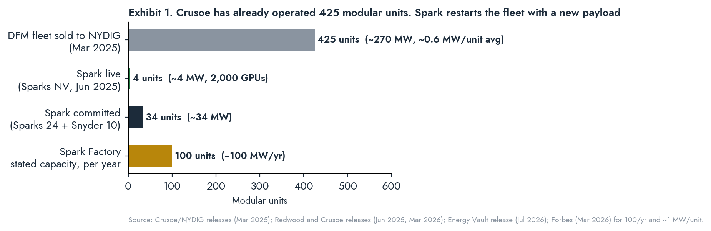
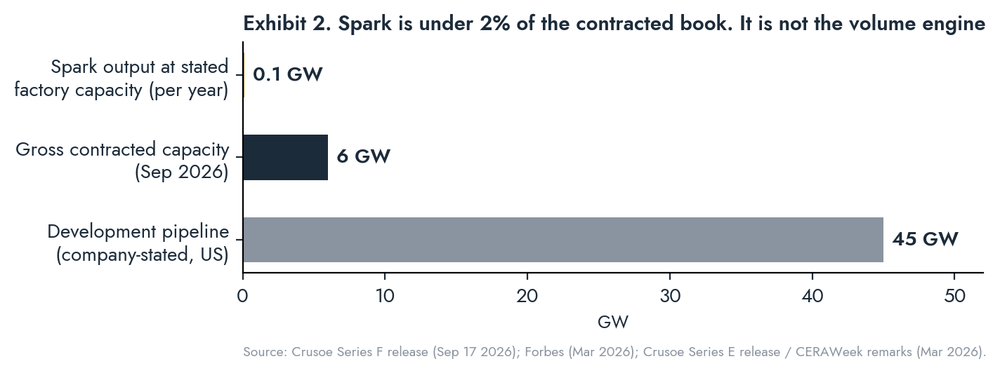

# THE GRID WIRE

## Special Report · Crusoe Spark: The Modular Pivot · September 22, 2026

*A focused analysis of Crusoe's modular data center program: the Spark product, the Brighton factory, the power-pairing strategy, the deployments to date, the business models being tested, and the economics of treating a data center as a manufactured product rather than a construction project. Method: primary documents first (company releases, Energy Vault Form 8-K exhibit, Redwood releases), on-record executives second, trade press flagged as data points. Undisclosed figures are marked n/d and are not estimated.*

TOPLINE_START
GREEN|Spark is a restart, not a launch. Crusoe operated 425 modular units (~270 MW) at wellheads for seven years before selling that fleet to NYDIG in March 2025. Spark is the same form factor with GPUs replacing ASICs and a dedicated factory behind it.
GREEN|The factory is real: 352,000 sq ft in Brighton, Colorado, $200M+ committed to lease, build-out and initial fleet, stated capacity 100 units per year, first factory-built modules Q3 2026. Cooling moves from air to liquid in H2 2026.
GREEN|The product works off-grid. Four units at Redwood's Sparks, Nevada campus have run since June 2025 on 12 MW of solar and 63 MWh of second-life EV batteries at 99.2% microgrid availability; the site is scaling to 24 units.
GREEN|Three business models are live or contracted: owned units on a partner's power (Redwood), sale-leaseback where the partner buys the units and leases them back as powered shell (Energy Vault, Snyder), and dedicated Edge Zones for sovereign or low-latency customers.
RED|Spark does not move the contracted book. One hundred units a year is roughly 100 MW, under 2% of Crusoe's 6 GW+ contracted capacity. Its value is inference margin, capacity certainty and origination, not gigawatts.
RED|No factory unit has shipped. Every Spark deployment to date predates Brighton. The Q3 2026 first-unit target and the Q1 2027 Snyder COD are the first tests of the manufactured model at production cadence.
TOPLINE_END

STATS: FACTORY | 352,000 sq ft | Brighton, CO
STATS: COMMITTED | $200M+ | lease, fit-out, first fleet
STATS: STATED CAPACITY | 100 / yr | ~1 MW per unit
STATS: LIVE UNITS | 4 | Sparks NV, since Jun 2025
STATS: CONTRACTED UNITS | 34 | Sparks 24 + Snyder 10
STATS: INFERENCE ARR | $100M+ | contracted, ~9 months

CLOCKS: First factory-built Spark units | Q3 2026 | Brighton
CLOCKS: Liquid-cooled Spark variant | H2 2026 | company target
CLOCKS: Sparks NV expansion to 24 units | 2026 | Redwood +8 MW storage
CLOCKS: Snyder 8 MW Phase 1 COD | Q1 2027 | Energy Vault
CLOCKS: Snyder Phase 2 to 25 MW | n/d | Energy Vault
CLOCKS: Form Energy iron-air deliveries | 2027 | 12 GWh reserved

---

# I. The Thesis in One Paragraph

KICKER: A data center is a building. Crusoe's bet is that it should be a product, and that the company already knows how to build the product because it built 425 of them.

Every large AI campus is a construction project: site-specific engineering, thousands of trades on site, a major air permit, a county abatement, an interconnection study, and a schedule measured in years. Spark inverts that. The unit is designed once, built on a line in Brighton, trucked to wherever roughly a megawatt of power exists, and energized in weeks. The cost of the approach is scale per site; the return is certainty of energization, factory labor instead of field labor, permitting below the thresholds that trigger large-load review, and the ability to place compute on power that no campus could use: a battery recycler's demonstration array, a storage vendor's test site, a curtailed feeder. Crusoe's claim to this space is not the product concept, which several vendors sell. It is that Crusoe is simultaneously the manufacturer, the power developer and the cloud operator, so the module ships with a customer already inside it. This report tests that claim against what has been built, what has been contracted, and what the economics require.

---

# II. Lineage: Crusoe Was Always a Modular Company

KICKER: The hyperscale campus was the detour. The container was the origin.

Crusoe's 2018 product, Digital Flare Mitigation, was a containerized data center placed at a wellhead, fed by associated gas that the operator would otherwise flare, running Bitcoin ASICs. By March 2025 the fleet stood at more than 425 units and more than 270 MW of generation across seven states and an Argentina JV. In June 2022 Crusoe acquired Easter-Owens Electric, a Colorado manufacturer of switchgear and electrical enclosures, to bring module fabrication in-house. That manufacturing base now runs to 500+ employees across Colorado, Oklahoma and Louisiana.

The DFM fleet was sold to NYDIG in March 2025 for an undisclosed price and a retained equity stake. Three months later, June 26, 2025, Crusoe announced Spark at Redwood's Sparks, Nevada campus. The sale and the relaunch were the same decision: exit the application, keep the capability, change the payload.

<<<ANGLE
The seven-year DFM record is the part of the Spark story that competitors cannot replicate. Vertiv, Schneider and a dozen integrators can fabricate a prefabricated module. None has operated 425 of them unattended in the Bakken and the Permian, on variable-quality fuel gas, through winters, with remote monitoring as the only on-site presence. Spark inherits that operating discipline plus a manufacturing footprint that was already building the electrical guts of the units. The GPU is the new part. The box, the power integration and the remote operations are not.
>>>

---

# III. The Product

KICKER: One megawatt, one truck, one integrated power-cooling-compute envelope, any fuel.

| Attribute | Public specification | Source |
|---|---|---|
| Unit size | ~1 MW IT load; "a little larger than a shipping container" | Forbes, Mar 2026 |
| Integration | Power distribution, cooling, fire suppression, remote monitoring, GPU-ready racks in one prefabricated unit | Company, Jun 2025 |
| GPU density | ~500 GPUs per unit implied (2,000 GPUs across 4 units at Sparks NV) | pv magazine / Redwood |
| Cooling | Air-cooled today; liquid-cooled variant H2 2026 for next-generation density | Company, Mar 2026 |
| Cluster scale | "Hundreds of kilowatts to tens or hundreds of megawatts"; standalone or grouped | Company via trade press |
| Power inputs | Solar + second-life EV batteries, grid, natural gas generation, SMRs (stated) | Company |
| Software stack | Full Crusoe Cloud platform; Managed Inference with MemoryAlloy cluster-wide KV cache fabric | Company |
| Stated inference performance | Up to 9.9x faster time-to-first-token, 5x throughput vs vLLM (company benchmark) | Company |
| Field timeline | ~3 months order to energization; "years to weeks" in the field | Company |
| Manufacturing | Brighton, CO factory; supply chain in CO, OK, LA | Company |

Two design choices carry the economics. First, the unit is sized at roughly 1 MW, which is the granularity at which stranded or surplus power exists in the real world (a solar array behind a factory, a peaker's idle capacity, a substation with unused headroom) and is below the 75 MW threshold at which Texas SB6 large-load rules attach to a single site. Second, the unit is optimized for inference rather than frontier training: MemoryAlloy is a KV-cache fabric, not an all-to-all training interconnect, and the company's own positioning puts Spark behind Managed Inference and Edge Zones, not behind Stargate.

---

# IV. The Factory

KICKER: $200M buys a line, a first fleet and a claim on 100 MW a year. The claim is untested until Q3 2026.

Crusoe Spark Factory, announced March 12, 2026: 352,000 sq ft in Brighton, Colorado, northeast of Denver. Company-stated commitment "more than $200 million" across the lease, build-out and investment in an initial fleet of units. Stated production target 100 modules per year (Forbes). First factory-produced modules expected Q3 2026. Roughly 200 local jobs, on top of the 500+ existing manufacturing employees. Company describes an "AI-powered manufacturing approach"; specifics n/d.

What the factory changes, in order of economic weight:

1. **Labor substitution.** Abilene runs 3,000 to 5,000 trades on site. Lochmiller has named skilled-trades labor as a co-equal bottleneck with power. A factory line converts that into repeatable manufacturing labor in one location, with the field crew reduced to placement, power tie-in and commissioning.
2. **Schedule certainty.** A module is complete when it leaves the line. Weather, site conditions and subcontractor sequencing no longer sit on the critical path. The remaining schedule risk is power availability at the destination, which Crusoe controls through its energy partners.
3. **Capex timing.** Capacity is added in 1 MW increments as demand arrives, rather than 200 MW increments committed 24 months ahead. For a cloud business with bookings growing 20x year over year off a small base, matching supply to demand at fine granularity is worth more than scale economies.
4. **Permitting and opposition.** A 1 MW unit is a minor source, needs no cooling tower, and does not trigger the county-level fights now visible in Abilene (housing displacement) and Cheyenne (moratorium debate). Forbes read the March announcement partly as a response to local backlash against large complexes.
5. **Design iteration.** The air-to-liquid transition in H2 2026 happens on a production line, not across a fleet of bespoke buildings.

<<<GOLD
The factory number to watch is not 100 units. It is the ratio of factory-built units to field-built units at the end of 2027. If Brighton ships 100 units and the company is still hand-building bespoke units elsewhere, the manufacturing thesis has not displaced the construction thesis; it has added a product line. If field builds go to zero and Brighton runs at stated capacity, Crusoe has changed how it makes data centers.
>>>

---

# V. Deployments to Date

KICKER: Two sites live or under construction, both on partner power, both under 25 MW. The product has been demonstrated; the cadence has not.

| Site | Partner | Power configuration | Units / capacity | Commercial structure | Status (Sep 2026) |
|---|---|---|---|---|---|
| Sparks, NV | Redwood Materials (Redwood Energy) | 12 MW solar (20-acre array) + 63 MWh second-life EV battery microgrid; grid as backup | 4 units, ~2,000 GPUs; expanding to 24 units (~7x compute) with +8 MW Redwood storage | Crusoe-owned units on Redwood power; Crusoe Cloud offtake | Live since Jun 2025; 99.2% microgrid availability, 99.9% cloud availability; expansion announced Mar 24 2026 |
| Snyder, TX (Scurry Co.) | Energy Vault (NYSE: NRGV) | Energy Vault powered shell at its technology center; land, power, redundancy, controls by Energy Vault | Phase 1: 10 units, 8 MW; Phase 2 to 25 MW | Energy Vault buys 10 Spark units; Crusoe leases them back as powered shell; Crusoe Cloud offtake | Framework Feb 11 2026 (8-K ex. 99.1); ground broken Jul 27 2026; COD Q1 2027 |
| Carson City, NV | n/d | n/d | n/d | n/d | Units pictured in company materials; no public detail |
| Edge Zones (customer sites) | Customer | Customer or Crusoe-arranged power | Per order | Dedicated units in customer-chosen geography; full Crusoe Cloud access | Product launched Mar 12 2026; no named Edge Zone customer disclosed |
| Legacy DFM (reference) | Oil and gas operators | Wellhead gas generation | 425+ units, ~270 MW | Owned; Bitcoin offtake | Sold to NYDIG Mar 2025 |

Deployed and contracted Spark capacity totals roughly 34 MW (Sparks 24 units, Snyder 10 units, assuming ~1 MW each). Against a 100-unit annual factory target, that is one-third of a year's output already spoken for before the line starts.

---

# VI. Power Pairing: The Actual Differentiator

KICKER: Any integrator can build the box. Crusoe's edge is that it arrives with the power partner already signed.

Spark's public power partners and the role each plays:

| Partner | Technology | Scale | Role in Spark program | Status |
|---|---|---|---|---|
| Redwood Energy | Second-life EV battery packs orchestrated via Pack Manager; solar | 12 MW / 63 MWh live; +8 MW expansion | Off-grid firming for the flagship Spark site; largest second-life deployment in the world at launch | Operating; Redwood CEO JB Straubel joined Crusoe board Sep 2026 |
| Form Energy | Iron-air, 100-hour storage | 12 GWh reserved; deliveries from 2027 | Multi-day firming for BTM renewables; reserved volume, pricing and delivery terms secured | Contracted Mar 2026 |
| Energy Vault | Storage and power integration; site owner | Snyder campus; up to 25 MW | Powered-shell landlord and unit purchaser | Under construction |
| Gas generation | Aeroderivative turbines (Crusoe's campus fleet) or DFM-style wellhead generation | Site-dependent | Stated Spark input; no public Spark-on-gas deployment since NYDIG sale | Stated capability |
| Grid | Utility interconnection | Site-dependent | Backup at Sparks; primary where available | In use |
| SMR | Small modular nuclear | n/d | Stated future input; no partner named | Aspirational |

<<<ANGLE
The Redwood result is the most important data point in the program and it is not about GPUs. Ninety-nine point two percent availability on a microgrid built from used car batteries and a 20-acre solar array, with grid only as backup, over seven months of continuous operation, tells you that a 1 MW compute load can be served reliably from non-firm generation with battery firming at a cost structure no utility interconnection can match on timeline. Redwood processes 20 GWh of batteries a year, about 90% of North America's lithium-ion flow, and can repurpose a meaningful share before recycling. Form Energy adds the multi-day case from 2027. Between them, Crusoe has a storage supply chain that can firm distributed renewables at the exact granularity Spark needs. That is what makes Spark a power-siting instrument rather than a container.
>>>

---

# VII. The Demand Engine: Inference and Edge Zones

KICKER: Spark exists to feed Managed Inference and Edge Zones. Those are the revenue lines that justify the factory.

**Managed Inference.** Launched late 2025. Company-stated contracted ARR over $100M by September 2026, roughly nine months after launch; WSJ reporting (via TNW) describes the line going from near zero at the start of 2026 to that run rate by summer. Company claims first place for inference speed on Artificial Analysis and a Gartner Magic Quadrant Visionary designation. Named users of Crusoe Cloud include Perplexity (multi-year, GB300 training plus Managed Inference serving), Cognition, Figure, Jane Street, Meta and Oracle. Which of these run on Spark versus campus capacity is n/d.

**Edge Zones.** Launched March 12, 2026 alongside the factory. Three stated use cases: low-latency inference placed near demand; dedicated enterprise clusters combining on-premise control with managed-cloud simplicity; sovereign deployments for governments and regulated industries inside their jurisdiction. Crusoe handles site selection, deployment, power integration and operations; the customer gets full Crusoe Cloud access and adds capacity by adding units. No Edge Zone customer has been named.

**Why inference, not training.** Frontier training wants tens of thousands of GPUs on one fabric in one building; that is Abilene. Inference wants distributed capacity close to users, tolerates smaller clusters, and is where the recurring revenue sits once models are deployed. A 1 MW, ~500-GPU module with a KV-cache fabric is sized for the second market. The company's positioning is consistent: Spark is described as running Crusoe Cloud and Managed Inference, never as Stargate capacity.

---

# VIII. Business Models Under Test

KICKER: Three structures, three different owners of the steel. The sale-leaseback is the one that scales without Crusoe's equity.

| Model | Who owns the unit | Who owns the power | Who books what | Example | Scaling constraint |
|---|---|---|---|---|---|
| Owned on partner power | Crusoe | Partner (Redwood) | Crusoe: cloud revenue; capex on balance sheet | Sparks NV | Crusoe equity per unit |
| Sale-leaseback | Partner buys units, leases back as powered shell | Partner (Energy Vault) | Crusoe: hardware sale + cloud revenue less lease; partner: asset yield + load for its storage | Snyder TX | Partner appetite for compute-shell risk |
| Edge Zone (dedicated) | Crusoe or customer, n/d | Customer or Crusoe-arranged | Crusoe: dedicated capacity contract + operations | None named | Customer sovereignty demand |

The Energy Vault structure is the template to watch. Energy Vault purchases 10 units and leases them back; Crusoe books hardware revenue on the sale, retains the cloud margin, and moves the real-asset ownership to a public company that needs load to make its storage economics work. If replicated, Spark scales on partners' balance sheets while Crusoe keeps the software and services margin. Energy Vault's public disclosures will also be the first third-party window into Spark unit costs and lease rates.

<<<GOLD
Spark's place in Crusoe's capital structure is the parent balance sheet, not project finance. The $200M+ factory commitment and the initial fleet sit in the same equity pool as the Series F ($3.9B initial close at $30.9B post). That is trivial against the $15B Abilene JV and it is deliberate: Spark is the part of the company that does not need a Blue Owl. The trade is that Spark's growth rate is bounded by how many Energy Vaults Crusoe can sign, because Crusoe will not want to carry 100 MW a year of module capex on its own equity indefinitely.
>>>

---

# IX. Economics: What Modularity Changes

KICKER: Modularity trades scale economies for time economies. In a market where the constraint is energization date, time is the scarcer input.

| Dimension | Gigawatt campus (Abilene) | Spark module | Direction of advantage |
|---|---|---|---|
| Unit of capacity | 100 to 300 MW per building | ~1 MW per unit | Campus on $/MW; Spark on match-to-demand |
| Field schedule | 12 to 36 months | Weeks after power is ready | Spark |
| Power source | 360 MW BTM gas + ERCOT interconnection | Any 1 MW+ source; storage-firmed renewables proven | Spark on flexibility; campus on firmness |
| Permitting | Major air permit; SB6 large-load; county abatement | Minor source; below 75 MW per site | Spark |
| Labor | 3,000 to 5,000 field trades | Factory labor + small field crew | Spark |
| Community exposure | High and rising | Low | Spark |
| Workload | Frontier training, 100,000 GPUs on one fabric | Inference, fine-tuning, dedicated clusters | Campus for training; Spark for inference |
| Capital structure | $15B project JV; hyperscaler lease | $200M factory; sale-leaseback or owned | Spark on capital intensity |
| Revenue capture | Development fee + lease + operations | Hardware sale + cloud margin | Spark on margin mix; campus on absolute $ |
| Cost per MW installed | n/d; trade estimates $15M to $20M all-in | n/d | Unknown; Energy Vault disclosures may reveal |

<<<ANGLE
Two readings, both correct. Spark is a power-siting instrument: it monetizes surplus megawatts at the granularity at which they actually exist, and the Redwood and Form Energy relationships give it a storage supply chain to firm them. And Spark does not move the contracted book: 100 units a year is 100 MW, under 2% of 6 GW. Investors who read the March factory announcement as Crusoe going small misread it. Crusoe is not abandoning hyperscale; it is building the part of the business that generates cloud margin without waiting for a hyperscaler signature, and doing it on a factory line so the margin is repeatable.
>>>

---

# X. Execution Scorecard

KICKER: Demonstrated at four units. Contracted at 34. Manufactured at zero, as of this date.

| Test | Target | Evidence to date | Status |
|---|---|---|---|
| Product works off-grid | Reliable compute on non-firm power | 99.2% microgrid availability, 7 months, Sparks NV | Passed |
| Product wins a third-party balance sheet | Partner buys units | Energy Vault 10-unit purchase, 8-K filed | Passed (contract), pending (delivery) |
| Factory ships | First units Q3 2026 | Factory announced Mar 2026; no shipment disclosed | Pending; quarter ends Sep 30 |
| Factory reaches cadence | 100 units / yr | n/d | Untested |
| Liquid-cooled variant | H2 2026 | Announced | Pending |
| Named Edge Zone customer | Sovereign or low-latency deployment | None disclosed | Untested |
| Spark on gas generation | Post-NYDIG deployment | None disclosed | Untested |
| Unit economics disclosed | Cost per MW, lease rate | n/d; Energy Vault reporting may surface | Untested |

---

# XI. Falsification Conditions

<<<FALSIFY
**The manufacturing thesis is falsified if** Brighton misses first factory-built units by more than two quarters past Q3 2026, or ships fewer than 50 units in the twelve months after first shipment.

**The off-grid thesis is falsified if** Sparks NV availability falls materially below 99% through the 24-unit expansion, or if the expansion requires primary grid service rather than backup.

**The sale-leaseback thesis is falsified if** Snyder Phase 1 misses Q1 2027 COD by more than one quarter, or if no second partner signs a comparable structure by end-2027.

**The inference-demand thesis is falsified if** Managed Inference ARR stalls below $250M by end-2027 or if disclosed Spark utilization falls below campus utilization.

**The Edge Zone thesis is falsified if** no named sovereign or low-latency customer is announced within twelve months of the March 2026 launch.

**The differentiation thesis is falsified if** a hyperscaler or a Vertiv-class integrator ships a factory-built ~1 MW GPU module with an integrated storage-firmed power offer at comparable cadence before Brighton reaches 100 units per year.
>>>

---

# XII. Conclusions

1. **Spark is a restart of Crusoe's original business with a better payload.** The company operated 425 modular units for seven years. The GPU is new; the box, the power integration and the remote operations are not. Competitors can copy the container. They cannot copy the operating record.

2. **The factory converts a construction company into a manufacturer, and the test is cadence, not concept.** $200M and 352,000 sq ft buy a stated 100 units a year. Zero have shipped. Q3 2026 is the first hard date and it ends in eight days.

3. **Power pairing is the moat.** Redwood proved storage-firmed renewables can carry compute at 99.2% availability. Form Energy adds the multi-day case from 2027. The differentiator is not the module; it is that the module arrives with a signed power partner.

4. **The sale-leaseback is how Spark scales without Crusoe's equity.** Energy Vault buys the steel and gets load for its storage; Crusoe keeps hardware revenue and cloud margin. If this replicates, Spark's growth is limited by partner appetite, not by Crusoe's balance sheet.

5. **Spark is the margin engine, not the volume engine.** Under 2% of contracted capacity at full factory output. Its job is Managed Inference and Edge Zone revenue at repeatable unit economics, and $100M of contracted inference ARR in nine months says the demand is there.

6. **The program is demonstrated, contracted and unmanufactured.** Four units live, 34 committed, none from the line. Everything the March 2026 announcements promised converts to evidence between now and Q1 2027.

---

*The Grid Wire is a capital markets and infrastructure briefing by Andrea Himmel, LAND · The Grid Wire. Sources: Crusoe company releases (Spark launch Jun 26 2025; Spark Factory and Edge Zones Mar 12 2026; Redwood expansion Mar 24 2026; Form Energy Mar 2026; Series F Sep 17 2026; NYDIG Mar 2025); Energy Vault Form 8-K exhibit 99.1 (Feb 11 2026) and July 27 2026 release; Redwood Materials releases (Jun 2025, Mar 2026); Forbes (Mar 12 2026); DatacenterDynamics; TechCrunch; pv magazine; Latitude Media (CERAWeek remarks). Unit size, GPU density per unit and factory cadence are trade-press or implied figures and are flagged as such. Nothing herein is investment advice or an offer to transact in any security.*
